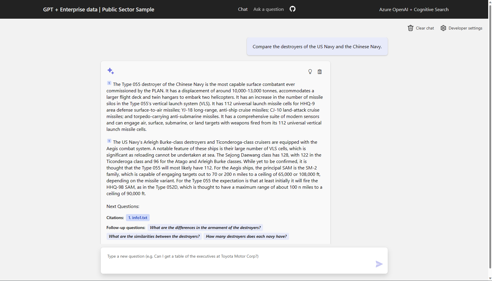

# Public Sector Information Assistant Accelerator

This sample demonstrates a few approaches for creating ChatGPT-like experiences over your own data using the Retrieval Augmented Generation pattern. It uses Azure OpenAI Service to access the ChatGPT model (gpt-35-turbo), and Azure Cognitive Search for data indexing and retrieval.

## Features

* Chat and Q&A interfaces
* Explores various options to help users evaluate the trustworthiness of responses with citations, tracking of source content, etc.
* Shows possible approaches for data preparation, prompt construction, and orchestration of interaction between model (ChatGPT) and retriever (Cognitive Search)
* Settings directly in the UX to tweak the behavior and experiment with options

# Getting Started

---

> **IMPORTANT:** In order to deploy and run this example, you'll need an **Azure subscription with access enabled for the Azure OpenAI service**. You can request access [here](https://aka.ms/oaiapply).

## Prerequisites

---

The PS Info Assistant Accelerator requires a variety of services in Azure. There are a few prerequisites required to deploy and configure the PS Info Assistant Accelerator. Please obtain these items first before continuing on to the deployment section of this guide.

>To get started with the PS Info Assistant Accelerator you will need the following:
>
>* An active Azure Subscription *
>* Administrative rights on the Azure Subscription
>
>\* *The Azure Subscription needs to be a paid subscription. While you can create a free tier of any of the Cognitive Services, you can only create one free Cognitive Service in an account so the trial would therefore not be able to handle all of the services in this example.*

You can sign up for an Azure subscription [here](https://azure.microsoft.com/en-us/free/). Once you have your prerequisite items, please move on to the Deployment Configuration step.

## Deployment Configuration

When you work in a codespace, the environment you are working in is created using a development container, or dev container, hosted on a virtual machine.

*More information can be found at [Developing in a codespaces](docs/developing_in_a_codespaces.md).*

Once you have the completed the setting up codespaces, please move on to the Sizing Estimation step.

---

# Sizing Estimator

 The PS Info Assistant Accelerator needs to be sized appropriately based on your use case. Please review our [Sizing Estimator](./docs/costestimator.md) to help find the configuration that fits your needs.

Once you have completed the Sizing Estimator, please move on to the Deployment steps.

---

# Deployment

There are several steps to deploying the PS Info Assistant Accelerator. The following checklist will guide you through configuring the PS Info Assistant Accelerator in your environments. Please follow the steps in the order they are provided as values from one step may be used in subsequent steps.

>1. Configure Local Development Environment
>       * [Configuring your Development Environment](/docs/development_environment.md)
>1. Configure Azure resources
>       * [Configure Azure resources](/infra/README.md)

---

# Using PS Info Assistant for the first time

TBD

## Resources

* [Revolutionize your Enterprise Data with ChatGPT: Next-gen Apps w/ Azure OpenAI and Cognitive Search](https://aka.ms/entgptsearchblog)
* [Azure Cognitive Search](https://learn.microsoft.com/azure/search/search-what-is-azure-search)
* [Azure OpenAI Service](https://learn.microsoft.com/azure/cognitive-services/openai/overview)
