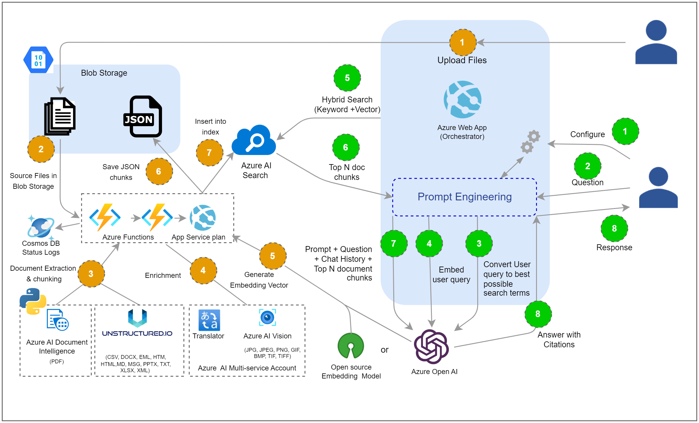

# Information Assistant Accelerator

This accelerator demonstrates a few approaches for creating ChatGPT-like experiences over your own data using the Retrieval Augmented Generation pattern. It uses Azure OpenAI Service to access the ChatGPT model (gpt-35-turbo), and Azure Cognitive Search for data indexing and retrieval.

---

## Features

* Chat and Q&A interfaces
* File Upload and automated chunking and indexing for PDF, HTML, and DOCX
* Monitoring the status of files uploaded and processed by the accelerator
* Interacting with your data in supported native languages*
* Explores various options to help users evaluate the trustworthiness of responses with citations, tracking of source content, etc.
* Shows possible approaches for data preparation, prompt construction, and orchestration of interaction between model (ChatGPT) and retriever (Cognitive Search)
* Settings directly in the UX to tweak the behavior and experiment with options

*\*See [Configuring your own language ENV file](/docs/features/configuring_language_env_files.md) for supported languages*

For a detailed review see our [Features](/docs/features/features.md) page.

---

## Responsible AI

The Information Assistant (IA) Accelerator and Microsoft are committed to the advancement of AI driven by ethical principles that put people first. 

**Read our [Transparency Note](./docs/transparency.md)**

Find out more with Microsoft's [Responsible AI resources](https://www.microsoft.com/en-us/ai/responsible-ai)

---

## Getting Started

The IA Accelerator relies on multiple Azure services and has certain prerequisites that need to be met before deployment. It's essential to procure these prerequisites prior to proceeding with the deployment instructions in this guide.

---

## Prerequisites

To get started with the IA Accelerator you will need the following:
>
>* An azure subscription with access enabled for the Azure OpenAI service.
You can request access [here](https://aka.ms/oaiapply) *
>* Administrative rights on the Azure Subscription
>* [Visual studio code](https://code.visualstudio.com/)
>
>
You can sign up for an Azure subscription [here](https://azure.microsoft.com/en-us/free/). 

Once you have your prerequisite items, please move on to the Deployment Configuration step.

**NOTICE:** * This codebase relies on the Azure OpenAI Service which must be procured first separately, subject to any applicable license agreement. Access to this code does not grant you a license or right to use Azure OpenAI Service.

The Information Assistant Accelerator requires access to one of the following Azure OpenAI models.

Model Name | Supported Versions
---|---
gpt-35-turbo | 0301, 0613
gpt-35-turbo-16k | N/A
**gpt-4** | N/A
gpt-4-32k | N/A

**Important:** It is recommended to use gpt-4 models to achieve the best results from the IA Accelerator. Access to gpt-4 requires approval which can be requested [here](https://aka.ms/oai/get-gpt4). If gpt-4 access is not available gpt-35-turbo (0613) is recommended.

---

## Deployment Configuration

The deployment process for the IA Accelerator, uses a concept of **Developing inside a Container** to containerize all the necessary pre-requisite component without requiring them to be installed on the local machine. The environment you will work in will be created using a development container, or dev container hosted on a virtual machine using GitHub Codespaces.

Begin by setting up your own Codespace using our  [Developing in a Codespaces](docs/developing_in_a_codespaces.md) documentation.

*If you want to configure your local desktop for development container, follow our [Configuring your System for Development Containers](/docs/configure_local_dev_environment.md) guide. More information can be found at [Developing inside a Container](https://code.visualstudio.com/docs/remote/containers).*

Once you have the completed the setting up Codespaces, please move on to the Sizing Estimation step.

---

## Sizing Estimator

 The IA Accelerator needs to be sized appropriately based on your use case. Please review our [Sizing Estimator](./docs/costestimator.md) to help find the configuration that fits your needs.

Once you have completed the Sizing Estimator, please move on to the Deployment steps.

---

## Deployment

The following checklist will guide you through configuring the IA Accelerator in your azure subscription. Please follow the steps in the order they are provided as values from one step may be used in subsequent steps.

>1. Configure your deployment settings
>       * [Configuring your Development Environment](/docs/development_environment.md)
>1. Configure Azure resources
>       * [Configure Azure resources](/infra/README.md)

---

## Using IA Accelerator for the first time

Now that you have successfully deployed the IA Accelerator, you are ready to use the accelerator to process some data.

To use the IA Accelerator, you need to follow these steps:

> 1. Prepare your data and upload it to Azure.
>
>       * Your data must be in a specified format to be valid for processing. See our [supported document types in the Feature documentation](/docs/features/features.md#document-pre-processing).
>       * Upload your data [via the data upload user interface](/docs/features/features.md#uploading-documents).
> 2. Once uploaded the system will automatically process and make the document(s) available to you and other users of the deployment.
> 3. Begin [having conversations with your data](/docs/features/features.md#having-a-conversation-with-your-data) by selecting the appropriate interaction method.

For more detailed information review the [Features](/docs/features/features.md) section of the documentation.

---

## Navigating the Source Code

This project has the following structure:

File/Folder | Description
---|---
.devcontainer/ | Dockerfile, devcontainer configuration, and supporting script to enable both CodeSpaces and local DevContainers.
app/backend/ | The middleware part of the IA website that contains the prompt engineering and provides an API layer for the client code to pass through when communicating with the various Azure services. This code is python based and hosted as a Flask app.
app/frontend/ | The User Experience layer of the IA website. This code is Typescript based and hosted as a Vite app and compiled using npm.
azure_search/ | The configuration of the Azure Search Index, Indexer, Skillsets, and Data Source that are applied in the deployment scripts.
docs/adoption_workshop/ | PPT files that match what is covered in the Adoption Workshop videos in Discussions.
docs/features/ | Detailed documentation of specific features and development level configuration for Information Assistant.
docs/ | Deployment and other supporting documentation that is primarily linked to from the README.md
functions/ | The pipeline of Azure Functions that handle the document extraction and chunking as well as the custom CosmosDB logging.
infra/ | The BICEP scripts that deploy the entire IA Accelerator. The overall accelerator is orchestrated via the `main.bicep` file but most of the resource deployments are modularized under the **core** folder. 
pipelines/ | Azure DevOps pipelines that can be used to enable CI/CD deployments of the accelerator.
scripts/environments/ | Deployment configuration files. This is where all external configuration values will be set.
scripts/ | Supporting scripts that perform the various deployment tasks such as infrastructure deployment, Azure WebApp and Function deployments, building of the webapp and functions source code, etc. These scripts align to the available commands in the `Makefile`.
Makefile | Deployment command definitions and configurations. You can use `make help` to get more details on available commands.
README.md | Starting point for this repo. It covers overviews of the Accelerator, Responsible AI, Environment, Deployment, and Usage of the Accelerator.

---

## Resources

* [Revolutionize your Enterprise Data with ChatGPT: Next-gen Apps w/ Azure OpenAI and Cognitive Search](https://aka.ms/entgptsearchblog)
* [Azure Cognitive Search](https://learn.microsoft.com/azure/search/search-what-is-azure-search)
* [Azure OpenAI Service](https://learn.microsoft.com/azure/cognitive-services/openai/overview)

## Trademarks

This project may contain trademarks or logos for projects, products, or services. Authorized use of Microsoft trademarks or logos is subject to and must follow [Microsoft’s Trademark & Brand Guidelines](https://www.microsoft.com/en-us/legal/intellectualproperty/trademarks/usage/general). Use of Microsoft trademarks or logos in modified versions of this project must not cause confusion or imply Microsoft sponsorship. Any use of third-party trademarks or logos are subject to those third-party’s policies.

## Code of Conduct

This project has adopted the [Microsoft Open Source Code of Conduct](https://opensource.microsoft.com/codeofconduct/). For more information see the [Code of Conduct FAQ](https://opensource.microsoft.com/codeofconduct/faq/) or contact [opencode@microsoft.com](mailto:opencode@microsoft.com) with any additional questions or comments.

## Reporting Security Issues

For security concerns, please see [Security Guidelines](./SECURITY.md)
