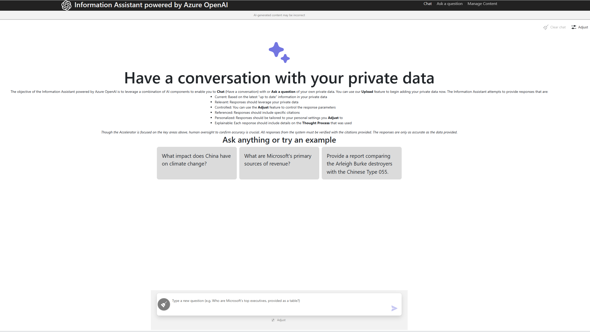

# Information Assistant Accelerator

This industry accelerator showcases integration between Azure and OpenAI's large language models. It leverages Azure Cognitive Search for data retrieval and ChatGPT-style Q&A interactions. Using the Retrieval Augmented Generation (RAG) design pattern with Azure Open AI's GPT models, it provides a natural language interaction to discover relevant responses to user queries. Azure Cognitive Search simplifies data ingestion, transformation, indexing, and multilingual translation.

The accelerator adapts prompts based on the model type for enhanced performance. Users can customize settings like temperature and persona for personalized AI interactions. It offers features like explainable thought processes, referenceable citations, and direct content for verification.

---

# Features

## Retrieval Augmented Generation (RAG)

**Retrieve Contextually Relevant Documents:** Utilize Azure Cognitive Search's indexing capabilities to retrieve documents that are contextually relevant for precise answers.

**Dynamic Model Selection:** Use GPT models (GPT-3.5 or GPT-4) tailored to your needs.

Technical overview of RAG: [Retrieval Augmented Generation using Azure Machine Learning prompt flow](https://learn.microsoft.com/en-us/azure/machine-learning/concept-retrieval-augmented-generation?view=azureml-api-2#why-use-rag)

## Prompt Engineering

**Adaptable Prompt Structure:** Our prompt structure is designed to be compatible with current and future Azure OpenAI's Chat Completion API versions and GPT models, ensuring flexibility and sustainability.

**Dynamic Prompts:** Dynamic prompt context based on the selected GPT model and users settings.

**Built-in Chain of Thought (COT):** COT is integrated into our prompts to address fabrications that may arise with large language models (LLM). COT encourages the LLM to follow a set of instructions, explain its reasoning, and enhances the reliability of responses.

**Few-Shot Prompting:** We employ few-shot prompting in conjunction with COT to further mitigate fabrications and improve response accuracy.

Go here for more information on [Prompt engineering techniques](https://learn.microsoft.com/en-us/azure/ai-services/openai/concepts/advanced-prompt-engineering?pivots=programming-language-chat-completions)

## Document Pre-Processing

**Custom Document Chunking:** The Azure OpenAI GPT models have a maximum token limit, which includes both input and output tokens. Tokens are units of text which can represent a single word, a part of a word, or even a character, depending on the specific language and text encoding being used. Consequently the model will not be able to process a 500 page text based document. Likewise, the models will not be able to process complex file types, such as PDF. This is why we pre-process these documents, before passing these to our search capability to then be exposed by the RAG pattern. Our process focused on

* content extraction from text-based documents
* creating a standard JSON representation of all a documents text-based content
* chunking and saving metadata into manageable sized to be used in the RAG pattern

Additional information on this process can be found [here](./docs/functions_flow.md)

### Azure Cognitive Search Integration

Search is used to index the chunks that were created during pre-processing.  When a question is asked and an optimal search term is generated, this is passed to Search to identify and return the optimal set of chunks to be used in generation of the response. Some further details are listed below

- **Data Enrichments:** Uses many Out-of-the-box Skillsets to extract enrichments from files such as utilizing Optical Character Recognition (OCR) to process images or converting tables within text into searchable text.

- **Multilingual Translation:** Leverages the Text Translation skill to interact with your data in supported native languages*, expanding your application's global reach.

*\*See [Configuring your own language ENV file](./docs/features/configuring_language_env_files.md) for supported languages*

## Customization and Personalization

**User-Selectable Options:** Users can fine-tune their interactions by adjusting settings such as temperature and persona, tailoring the AI experience to their specific needs.

**UX Settings:** Easily tweak behavior and experiment with various options directly in the user interface.

## Enhanced AI Interaction

**Simple File Upload and Status:** We have put uploading of files into the Accelerator in the hands of the users by providing a simple drag-and-drop user interface for adding new content and a status page for monitoring document pre-processing.

**Visualizing Thought Process:** Gain insights into the AI's decision-making process by visualizing how it arrives at answers, providing transparency and control.

**Proper Citations and References:** The platform generates referenceable source content, designed to enhance trustworthiness and accountability in AI-generated responses.

## Works in Progress (Future releases)

**Incorporating Vector and Hybrid Search in Azure Cognitive Search:** We're actively working on enhancing Azure Cognitive Search by incorporating vector and hybrid search capabilities. This will enable more advanced search and retrieval mechanisms, further improving the precision and efficiency of document retrieval.

**Adding Evaluation Guidance and Metrics:** To ensure transparency and accountability, we are researching comprehensive evaluation guidance and metrics. This will assist users in assessing the performance and trustworthiness of AI-generated responses, fostering confidence in the platform.

**Research of [Unstructured.io](https://unstructured-io.github.io/unstructured/):**
The unstructured library is open source and designed to help pre-process unstructured data, such as documents, for use in downstream machine learning tasks. Our current position is we will continue with the Document Intelligence service, formerly Form Recognizer, for PDF pre-processing, but we will introduce unstructured.io as a catcher for many document types which we don't currently process.

For a detailed review see our [Features](./docs/features/features.md) page.

---

## Data Collection Notice

The software may collect information about you and your use of the software and send it to Microsoft. Microsoft may use this information to provide services and improve our products and services. You may turn off the telemetry as described in the repository. There are also some features in the software that may enable you and Microsoft to collect data from users of your applications. If you use these features, you must comply with applicable law, including providing appropriate notices to users of your applications together with a copy of Microsoft’s privacy statement. Our privacy statement is located at https://go.microsoft.com/fwlink/?LinkID=824704. You can learn more about data collection and use in the help documentation and our privacy statement. Your use of the software operates as your consent to these practices.

### About Data Collection

Data collection by the software in this repository is used by Microsoft solely to help justify the efforts of the teams who build and maintain this accelerator for our customers. It is your choice to leave this enabled, or to disable data collection.

Data collection is implemented by the presence of a tracking GUID in the environment variables at deployment time. The GUID is associated with each Azure resource deployed by the installation scripts. This GUID is used by Microsoft to track the Azure consumption this open source solution generates.

### How to Disable Data Collection

To disable data collection, follow the instructions in the [Configure ENV files](./docs/development_environment.md#configure-env-files) section for `ENABLE_CUSTOMER_USAGE_ATTRIBUTION` variable before deploying.

---

## Responsible AI

The Information Assistant (IA) Accelerator and Microsoft are committed to the advancement of AI driven by ethical principles that put people first. 

**Read our [Transparency Note](./docs/transparency.md)**

Find out more with Microsoft's [Responsible AI resources](https://www.microsoft.com/en-us/ai/responsible-ai)

---

## Getting Started

The IA Accelerator relies on multiple Azure services and has certain prerequisites that need to be met before deployment. It's essential to procure these prerequisites prior to proceeding with the deployment instructions in this guide.

---

## Prerequisites

To get started with the IA Accelerator you will need the following:
>
>* An azure subscription with access enabled for the Azure OpenAI service.
You can request access [here](https://aka.ms/oaiapply) *
>* Administrative rights on the Azure Subscription
>* [Visual studio code](https://code.visualstudio.com/)
>
>
You can sign up for an Azure subscription [here](https://azure.microsoft.com/en-us/free/). 

Once you have your prerequisite items, please move on to the Deployment Configuration step.

**NOTICE:** * This codebase relies on the Azure OpenAI Service which must be procured first separately, subject to any applicable license agreement. Access to this code does not grant you a license or right to use Azure OpenAI Service.

The Information Assistant Accelerator requires access to one of the following Azure OpenAI models.

Model Name | Supported Versions
---|---
gpt-35-turbo | 0301, 0613
**gpt-35-turbo-16k** | current version
**gpt-4** | current version
gpt-4-32k | current version

**Important:** It is recommended to use gpt-4 models to achieve the best results from the IA Accelerator. Access to gpt-4 requires approval which can be requested [here](https://aka.ms/oai/get-gpt4). If gpt-4 access is not available gpt-35-turbo-16k (0613) is recommended.

---

## Deployment Configuration

The deployment process for the IA Accelerator, uses a concept of **Developing inside a Container** to containerize all the necessary pre-requisite component without requiring them to be installed on the local machine. The environment you will work in will be created using a development container, or dev container hosted on a virtual machine using GitHub Codespaces.

Begin by setting up your own Codespace using our  [Developing in a Codespaces](docs/developing_in_a_codespaces.md) documentation.

*If you want to configure your local desktop for development container, follow our [Configuring your System for Development Containers](./docs/configure_local_dev_environment.md) guide. More information can be found at [Developing inside a Container](https://code.visualstudio.com/docs/remote/containers).*

Once you have the completed the setting up Codespaces, please move on to the Sizing Estimation step.

---

## Sizing Estimator

 The IA Accelerator needs to be sized appropriately based on your use case. Please review our [Sizing Estimator](./docs/costestimator.md) to help find the configuration that fits your needs.

Once you have completed the Sizing Estimator, please move on to the Deployment steps.

---

## Deployment

The following checklist will guide you through configuring the IA Accelerator in your azure subscription. Please follow the steps in the order they are provided as values from one step may be used in subsequent steps.

>1. Configure your deployment settings
>       * [Configuring your Development Environment](./docs/development_environment.md)
>1. Configure Azure resources
>       * [Configure Azure resources](https://github.com/microsoft/PubSec-Info-Assistant/blob/main/infra/README.md)

---

## Using IA Accelerator for the first time

Now that you have successfully deployed the IA Accelerator, you are ready to use the accelerator to process some data.

To use the IA Accelerator, you need to follow these steps:

> 1. Prepare your data and upload it to Azure.
>
>       * Your data must be in a specified format to be valid for processing. See our [supported document types in the Feature documentation](./docs/features/features.md#document-pre-processing).
>       * Upload your data [via the data upload user interface](./docs/features/features.md#uploading-documents).
> 2. Once uploaded the system will automatically process and make the document(s) available to you and other users of the deployment.
> 3. Begin [having conversations with your data](./docs/features/features.md#having-a-conversation-with-your-data) by selecting the appropriate interaction method.

For more detailed information review the [Features](./docs/features/features.md) section of the documentation.

---

## Navigating the Source Code

This project has the following structure:

File/Folder | Description
---|---
.devcontainer/ | Dockerfile, devcontainer configuration, and supporting script to enable both CodeSpaces and local DevContainers.
app/backend/ | The middleware part of the IA website that contains the prompt engineering and provides an API layer for the client code to pass through when communicating with the various Azure services. This code is python based and hosted as a Flask app.
app/frontend/ | The User Experience layer of the IA website. This code is Typescript based and hosted as a Vite app and compiled using npm.
azure_search/ | The configuration of the Azure Search Index, Indexer, Skillsets, and Data Source that are applied in the deployment scripts.
docs/adoption_workshop/ | PPT files that match what is covered in the Adoption Workshop videos in Discussions.
docs/features/ | Detailed documentation of specific features and development level configuration for Information Assistant.
docs/ | Deployment and other supporting documentation that is primarily linked to from the README.md
functions/ | The pipeline of Azure Functions that handle the document extraction and chunking as well as the custom CosmosDB logging.
infra/ | The BICEP scripts that deploy the entire IA Accelerator. The overall accelerator is orchestrated via the `main.bicep` file but most of the resource deployments are modularized under the **core** folder. 
pipelines/ | Azure DevOps pipelines that can be used to enable CI/CD deployments of the accelerator.
scripts/environments/ | Deployment configuration files. This is where all external configuration values will be set.
scripts/ | Supporting scripts that perform the various deployment tasks such as infrastructure deployment, Azure WebApp and Function deployments, building of the webapp and functions source code, etc. These scripts align to the available commands in the `Makefile`.
Makefile | Deployment command definitions and configurations. You can use `make help` to get more details on available commands.
README.md | Starting point for this repo. It covers overviews of the Accelerator, Responsible AI, Environment, Deployment, and Usage of the Accelerator.

---

## Resources

* [Revolutionize your Enterprise Data with ChatGPT: Next-gen Apps w/ Azure OpenAI and Cognitive Search](https://aka.ms/entgptsearchblog)
* [Azure Cognitive Search](https://learn.microsoft.com/azure/search/search-what-is-azure-search)
* [Azure OpenAI Service](https://learn.microsoft.com/azure/cognitive-services/openai/overview)

## Trademarks

This project may contain trademarks or logos for projects, products, or services. Authorized use of Microsoft trademarks or logos is subject to and must follow [Microsoft’s Trademark & Brand Guidelines](https://www.microsoft.com/en-us/legal/intellectualproperty/trademarks/usage/general). Use of Microsoft trademarks or logos in modified versions of this project must not cause confusion or imply Microsoft sponsorship. Any use of third-party trademarks or logos are subject to those third-party’s policies.

## Code of Conduct

This project has adopted the [Microsoft Open Source Code of Conduct](https://opensource.microsoft.com/codeofconduct/). For more information see the [Code of Conduct FAQ](https://opensource.microsoft.com/codeofconduct/faq/) or contact [opencode@microsoft.com](mailto:opencode@microsoft.com) with any additional questions or comments.

## Reporting Security Issues

For security concerns, please see [Security Guidelines](./SECURITY.md)
