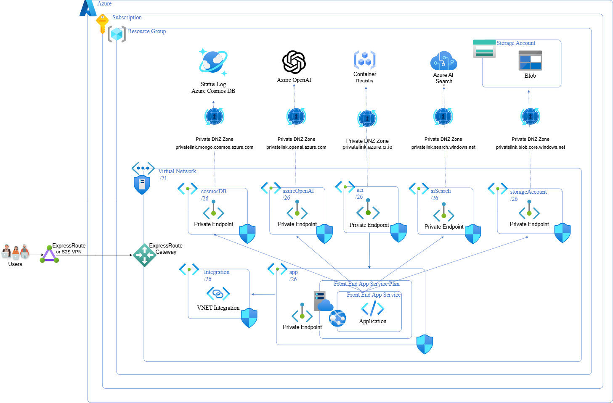

# Architecture of the Information Assistant agent template

* [Overview](#overview)
* [Architecture](#architecture)
  * [High level architecture](#high-level-architecture)
  * [Detailed architecture](#detailed-architecture)
* [Front end architecture](#front-end-architecture)
* [Back end service architecture](#back-end-service-architecture)
* [Private virtual network and endpoint architecture](#private-virtual-network-and-endpoint-architecture)

[!IMPORTANT]  
> The Information Assistant assumes clients have or will establish secure communications from their enterprise to the Azure cloud that will enable it to be deployed (e.g., Azure ExpressRoute, Azure VPN Gateway).
>
>
>It is recommended to use a DDoS Protection Plan for Virtual Network Protection, but it is not required. There is a limit of 1 DDoS protection plan for a subscription in a region. You can reuse an existing DDoS plan in your tenant, Information Assistant can deploy one for you, or you can choose to not use a DDoS Protection Plan on your virtual network.
>
>Information Assistant agent template is compatible with the [Sovereign Landing Zone (SLZ)](https://aka.ms/slz) which is a [Microsoft Cloud for Sovereignty](https://www.microsoft.com/industry/sovereignty/cloud) offering. It is currently only compatible with the *Online* management group scope. See the [deploy with Microsoft Cloud for Sovereignty](architecture.md#deploying-with-microsoft-cloud-for-sovereignty) section below for more details.

## Overview

Information Assistant agent template is for scenarios where infrastructure security and privacy are essential, like those in public sector and regulated industries. Key features of the architecture include:

* **Disabling public network access**: Restrict external access to safeguard public access.
* **Virtual network protection**: Deploy your Azure services within a secure virtual network.
* **Private endpoints**: The deployed Azure services connect exclusively through private endpoints within a virtual network where available.
* **Data encryption at rest and in transit**: Ensure encryption of data when stored and during transmission.

## Architecture

Information Assistant agent template builds on the [Single Virtual Network Pattern](https://learn.microsoft.com/azure/architecture/networking/guide/network-level-segmentation#pattern-1-single-virtual-network) in which all components of your workload are inside a single virtual network (VNet). This pattern is only possible if you're operating in a single region, as a virtual network can't span multiple regions. The virtual network isolates your resources and traffic from other VNets and provides a boundary for applying security policies. Services deployed within the same virtual network communicate securely. This additional level of isolation helps prevent unauthorized external access to services and helps protect your data.

Additionally, each Azure Service type is isolated into subnets to allow further protection to be applied via Network Security Groups (NSGs) if you want to extend the provided configuration.

### High level architecture

The secure communication mechanism is represented in this high level architecture diagram with ExpressRoute although there are other options for securely communicating with Azure. Azure ExpressRoute helps protect data during communication. In this example, an organizations enterprise networking configuration can be peered with the virtual network deployed by Information Assistant agent template to allow users access to the application.

### Detailed architecture

The detailed architecture diagram below shows the VNet is subdivided into subnets that further segment network resources. This allows more granular control of network traffic and security rules. These subnets contain private endpoints, network interfaces that connect privately and securely to Azure services. By using a private IP address from your VNet, a private endpoint enables secure communications with Azure services from your VNet, reducing exposure to the public internet. This improves network security through:

1. Network isolation: VNets and Subnets provide a segregated environment where only authorized resources can communicate with each other.
2. Reduced Attack Surface: Private endpoints ensure that Azure services are accessed via the private IP space of your VNet, not over the public network, which significantly reduces the risk of external attacks.
3. Granular Access Control: Network Security Groups (NSGs) can be associated with VNets, subnets and network interfaces to filter network traffic to and from resources within a VNet. This allows for fine-tuned control over access and security policies.

Deploying a dedicated Azure service into your virtual network provides the following capabilities:

* Resources within the virtual network can communicate with each other privately, through private IP addresses.
* On-premises resources can access resources in a virtual network using private IP addresses over a VPN Gateway or ExpressRoute.
* Virtual networks can be peered to enable resources in the virtual networks to communicate with each other, using private IP addresses.
* The Azure service fully manages service instances in a virtual network. This management includes monitoring the health of the resources and scaling with load.
* Private endpoints allow ingress of traffic from your virtual network to an Azure resource securely.

The Information Assistant deploys to a resource group within a subscription in your tenant. The deployment requires a secure communication channel to complete successfully, as illustrated by the ExpressRoute or VPN Gateway for user access to the enterprise virtual Network on the left of the diagram below that is peered with the Information Assistants virtual network.

## Front end architecture

The user experience is provided by a front-end application deployed as an App Service and associated with an App Service Plan. When the front-end application needs to securely communicate with resources in the VNet, the outbound calls from the front-end application are enabled through VNet integration ensuring that traffic is sent over the private network where private DNS zones resolve names to private VNet IP addresses. The diagram below shows user's securely connecting to the VNet to interact with the Information Assistant user experience (UX) from a network peered with the Information Assistant virtual network.

The front-end application uses VNet integration to connect to the private network and private DNS zones to access the appropriate services such as:

* **Azure Storage Account (Blob Storage)**: Used for file uploads.
* **Azure OpenAI**: Enables prompt submissions.
* **Azure AI Search**: Facilitates content discovery from uploaded files.
* **Azure Container Registry**: Where the Azure App Service pulls its source image from to host the application.

## Back end service architecture

Back-end processing handles processing of your private data, performs document extraction and enrichment leveraging Azure AI services, and performs embedding and indexing leveraging Azure OpenAI and Azure AI Search. All public network access to the back-end processing system is disallowed including the Azure Portal. Data can be loaded into the secured process in two ways:

* Through the Information Assistant Content Management UX feature
* Data can be added to the Azure Storage Account from a device that is on a virtual network peered to the Information Assistant virtual network

All of the services in the back-end are integrated through private endpoints ensuring that traffic is sent over the private network where private DNS zones resolve names to private VNet IP addresses as illustrated in the following diagram:

### Private virtual network and endpoint architecture

The tables below contain additional details on private endpoints and Private Links. A Private Link provides access to services over the private endpoint network interface. Private endpoint uses a private IP address from your virtual network. Traffic between your virtual network and the service that you're accessing travels across the Azure network backbone. As a result, you no longer access the service over a public endpoint, effectively reducing exposure and enhancing security.

#### Information Assistant virtual network configuration for Azure Commercial

Information Assistant Virtual Network CIDR: x.x.x0/24

Subnet | CIDR | Private Links | Azure Service
---|---|---|---
ampls | x.x.x.0/27 | privatelink.azure-automation.net privatelink.monitor.azure.com privatelink.ods.opinsights.azure.com privatelink.oms.opinsights.azure.com | Azure Log Analytics Azure Application Insights Azure Monitor
storageAccount | x.x.x.32/28 | privatelink.blob.core.windows.net privatelink.file.core.windows.net privatelink.queue.core.windows.net privatelink.table.core.windows.net | Azure Storage Account
azureAi | x.x.x.56/29 | privatelink.cognitiveservices.azure.com | Azure AI multi-service account Azure Document Intelligence
keyVault | x.x.x.72/29 | privatelink.vaultcore.azure.net | Azure Key Vault
app | x.x.x.64/29 | privatelink.azurewebsites.net | Azure App Service
integration | x.x.x.192/26 | N/A | Azure App Service
aiSearch | x.x.x.96/29 | privatelink.search.windows.net | Azure AI Search
azureOpenAi | x.x.x.120/29 | privatelink.openai.azure.com | Azure Open AI
acr | x.x.x.128/29 | privatelink.azurecr.io | Azure Container Registry
dns | x.x.x.176/28 | N/A | Azure DNS Private Resolver
bing | x.x.x.112/29 | N/A | Bing Search

#### Information Assistant virtual network configuration for Azure USGovernment

Information Assistant Virtual Network CIDR: x.x.x0/24

Subnet | CIDR | Private Links | Azure Service
---|---|---|---
ampls | x.x.x.0/27 | privatelink.azure-automation.us privatelink.monitor.azure.us privatelink.ods.opinsights.azure.us privatelink.oms.opinsights.azure.us | Azure Log Analytics Azure Application Insights Azure Monitor
storageAccount | x.x.x.32/28 | privatelink.blob.core.usgovcloudapi.net privatelink.file.core.usgovcloudapi.net privatelink.queue.core.usgovcloudapi.net privatelink.table.core.usgovcloudapi.net | Azure Storage Account
azureAi | x.x.x.56/29 | privatelink.cognitiveservices.azure.us | Azure AI multi-service account Azure Document Intelligence
keyVault | x.x.x.72/29 | privatelink.vaultcore.usgovcloudapi.net | Azure Key Vault
app | x.x.x.64/29 | privatelink.azurewebsites.us | Azure App Service
integration | x.x.x.192/26 | N/A | Azure App Service
aiSearch | x.x.x.96/29 | privatelink.search.azure.us | Azure AI Search
azureOpenAi | x.x.x.120/29 | privatelink.openai.azure.us | Azure Open AI
acr | x.x.x.128/29 | privatelink.azurecr.us | Azure Container Registry
dns | x.x.x.176/28 | N/A | Azure DNS Private Resolver
bing | x.x.x.112/29 | N/A | Bing Search

See [Deployment - Custom Network Settings](./deployment/deployment_features.md#custom-network-settings) section for customizing the values for your network.
