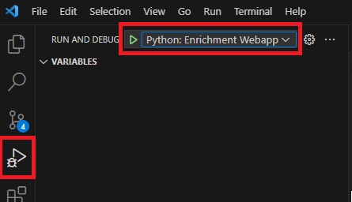

# Debugging the Container Based Web App Locally in VSCode

Embeddings processing is performed in a docker container which is deployed from the Azure Container Registry (ACR) to the Webapp. The system then uses this fucntionality to create embeddings when messages arrive in the embeddings queue. At some point you may wish to step through this code line by line in VS Code. Prior to debugging, ensure you stop the webapp in the Azure portal, or it will pick up and test messages you deliver to the embeddings queue before your code can read the message.

To start debugging firstly add breakpoints to the code and then simply select the Run & Debug menu option in the left bar, or Ctrl+Shift+D. Next select Python: FastAPI - enrichment app and hit the play button. This will then initiate the code and stop on your first breakpoint.

One tip is to save a copy of a message in the embeddings queue which triggers your logic. Then you will be able to just resubmit this message again and again to initiate and trace your code.

