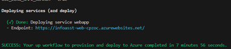

# Deploying Information Assistant (IA) agent template to Azure

:warning: **IMPORTANT**: Please ensure you have met the [Azure account requirements](../../README.md#azure-account-requirements) before continuing.

Follow these steps to get the agent template up and running in a subscription of your choice. Note that there may be specific instructions for deploying to [Azure Government or other Sovereign regions](/docs/deployment/enable_sovereign_deployment.md).

## Development Environment Configuration

The deployment process for the IA agent template, uses a concept of **Developing inside a Container** to containerize all the necessary pre-requisite component without requiring them to be installed on the local machine. The environment you will work in will be created using a development container or dev container hosted on a virtual machine using GitHub Codespaces.

Begin by first forking the Information Assistant repository into your own repository. This can be useful for managing any changes you may require for your local environment. It will also enable you to accept and merge changes from the Information Assistant repo as future releases and hotfixes are made available.

To fork the repo simply click the **Fork** button at the top of the Information Assistant Repo page and follow the steps to set up your new fork.


Once you have forked the repo, you can then use the following button to open the Information Assistant GitHub Codespaces. You will need to select your forked repo and the location for your GitHub Codespaces to run in.

[](https://github.com/codespaces/new?hide_repo_select=false&ref=main&machine=basicLinux32gb&devcontainer_path=.devcontainer%2Fdevcontainer.json)

Begin by setting up your own GitHub Codespaces using our [Developing in Codespaces](/docs/deployment/developing_in_a_GitHub_Codespaces.md) documentation.

*If you want to configure your local desktop for development container or you do not have access to GitHub Codespaces, follow our [Configuring your System for Development Containers](/docs/deployment/configure_local_dev_environment.md) guide. More information can be found at [Developing inside a Container](https://code.visualstudio.com/docs/remote/containers).*

Once you have completed setting up a GitHub Codespaces, please move on to the Sizing Estimation step.

## Sizing estimator

 The IA agent template needs to be sized appropriately based on your use case. Please review our [sizing estimator](/docs/costestimator.md) to help find the configuration that fits your needs.

 To change the size of components deployed, make changes in the azd parameters detailed below.

Once you have completed the sizing estimator and sized your deployment appropriately, please move on to the Configure your local environment variables step.

## Upgrading or migrating from previous versions

Information Assistant agent template v2.0 is not able to upgrade from prior versions. A new installation is required.

## Azure resource provider registration

The following resource providers must be registered within your subscription prior to beginning the deployment to prevent deployment errors:

* Microsoft.ContainerRegistry
* Microsoft.CognitiveServices
* Microsoft.Search
* Microsoft.Web
* Microsoft.Network
* Microsoft.Storage
* Microsoft.OperationalInsights
* Microsoft.KeyVault
* Microsoft.AlertsManagement
* Microsoft.Insights

The following command lists all the subscription's resource providers that are Registered.

``` bash
az provider list --query "[?registrationState=='Registered']" --output table
```

Register the resource providers required with the az provider register command.

``` bash
az provider register --namespace Microsoft.ContainerRegistry
az provider register --namespace Microsoft.Search
az provider register --namespace Microsoft.Web
az provider register --namespace Microsoft.Network
az provider register --namespace Microsoft.Storage
az provider register --namespace Microsoft.OperationalInsights
az provider register --namespace Microsoft.KeyVault
az provider register --namespace Microsoft.AlertsManagement
az provider register --namespace Microsoft.Insights
```

Confirm all the resource providers have been registered before proceeding with the deployment.

Get the registration status for a specific resource provider:

``` bash
az provider list --query "[?namespace=='Microsoft.Web']" --output table
```

## Log into Azure using the Azure CLI

You can use the bash prompt in your GitHub Codespaces to issue the following commands:

``` bash
    az login
```

This will launch a browser session where you can complete you login. If you get an error on this step, we suggest you use the device code option for login.

> **NOTICE:** if your organization requires managed devices, ensure that you are running the GitHub Codespaces from your managed device's VS Code installation. For more information, please see the [Developing in a Codespace](/docs/developing_in_a_codespaces.md#opening-a-codespace-in-vs-code) documentation.

Next from the bash prompt run:

``` bash
    az account show
```

The output here should show that you're logged into the intended Azure subscription.  If this isn't showing the right subscription then you can list all the subscriptions you have access to with:

``` bash
    az account list
```

If you're a part of multiple tenants, ensure you're in the right tenant by setting the tenantID

``` bash
    az login --tenant tenantID
```

From this output, grab the Subscription ID of the subscription you intend to deploy to and run:

``` bash
    az account set --subscription mysubscriptionID
```

## Configure your local environment for deployment

You now need to set up your local environment in preparation for deployment. IA agent template uses [Azure Developer CLI](https://learn.microsoft.com/en-us/azure/developer/azure-developer-cli/overview) (azd) to provision Azure resources and deploy the application code.

Inside your development environment (GitHub Codespaces or Container), do the following:

1. Configure azd to use the Azure CLI login you performed above:

    ``` bash
    azd config set auth.useAzCliAuth "true"
    ```

1. Create a new azd environment:

   ``` bash
   azd env new
   ```

   Enter a name that will be used for the resource group name (i.e. infoasst-*environment name*). This will create a new folder in the .azure folder, and set it as the active environment for any calls to azd going forward.

1. (Optional) This is the point where you can customize the deployment by setting environment variables, in order to [use existing Azure Open AI resources](./deployment_features.md#azure-open-ai-resources), [enable feature flags](./deployment_features.md#feature-flags), [customize network settings](./deployment_features.md#custom-network-settings), and several other [optional settings](./deployment_features.md).

1. Run `azd up` - This will provision Azure resources and deploy this sample to those resources, including building the search index based on the files found in the `./data` folder.

    * **Important**: Beware that the resources created by this command will incur immediate costs, primarily from the AI Search resource. These resources may accrue costs even if you interrupt the command before it is fully executed. You can run `azd down` or delete the resources manually to avoid unnecessary spending.
    * You will be prompted to select two locations, one for the majority of resources and one for the OpenAI resource, which is currently a short list. That location list is based on the [OpenAI model availability table](https://learn.microsoft.com/azure/cognitive-services/openai/concepts/models#model-summary-table-and-region-availability) and may become outdated as availability changes.

1. After the application has been successfully deployed you will see a URL printed to the console.  Click that URL to interact with the application in your browser.
It will look like the following:



> NOTE: It may take 5-10 minutes after you see 'SUCCESS' for the application to be fully deployed. If you see a "Python Developer" welcome screen or an error page, then wait a bit and refresh the page.

### Deploying again

If you've only changed the backend/frontend code in the `app` folder, then you don't need to re-provision the Azure resources. You can just run:

```shell
azd deploy
```

If you've changed the infrastructure files (`infra` folder or `azure.yaml`), then you'll need to re-provision the Azure resources. You can do that by running:

```shell
azd up
```

*A set of known issues and their workarounds that we have found can be found in [Known Issues](/docs/knownissues.md).*

## Configure AD app registration ( manual steps )

If you have insufficient permissions at the tenant level (Application Administrator Entra Role), follow the guide to complete the deployment [manual app registration](/docs/deployment/manual_app_registration.md).

## Configure authentication and authorization

If you have chosen to enable authentication and authorization for your deployment by setting the environment variable `REQUIRE_WEBSITE_SECURITY_MEMBERSHIP` to `true`, you will need to configure it at this point. Please see [Known Issues](/docs/knownissues.md#error-your-adminstrator-has-configured-the-application-infoasst_web_access_xxxxx-to-block-users) section for guidance on how to configure.

**NOTICE:** If you haven't enabled this, but your Tenant requires this, you may still need to configure as noted above.

## Next steps

At this point deployment is complete. Please go to the [Using the IA agent template for the first time](/docs/deployment/using_ia_first_time.md) section and complete the following steps.

## Additional Considerations for a Production Adoption

There are considerations for adopting the Information Assistant (IA) agent template into a production environment. [See this documentation](/docs/deployment/considerations_production.md).

## Need Help?

Check these [troubleshooting methods](/docs/deployment/troubleshooting.md).

If you need assistance with deployment or configuration of this agent template, please leverage the Discussion forum in this repository, or reach out to your Microsoft Unified Support account manager.
