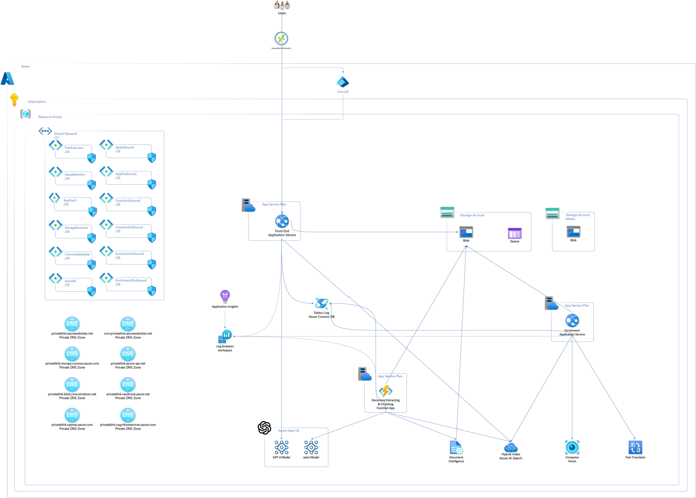
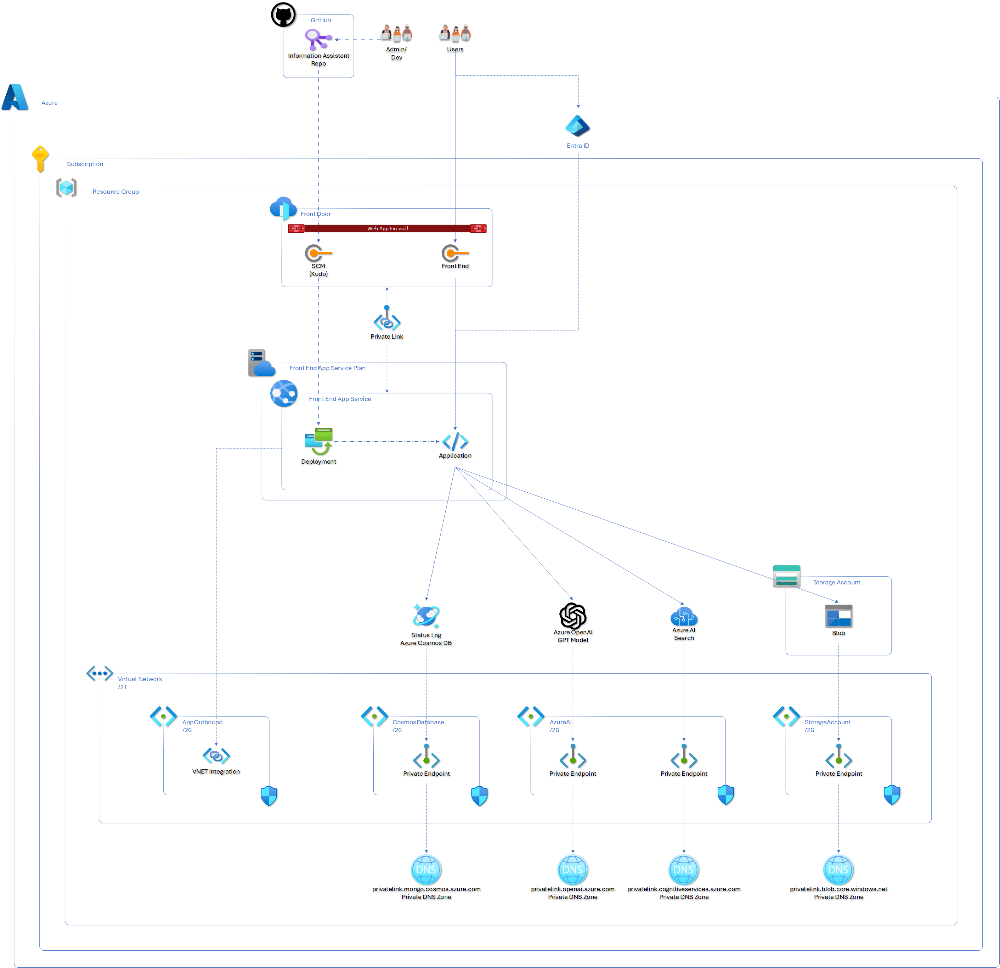

# Enable Secure Deployment

## Overview

> [!IMPORTANT]  
> The Information Assistant secure deployment option assumes clients have or will establish secure communications from their enterprise to the Azure cloud that will enable users to access Information Assistant capabilities. The secure communication mechanism is represented in this high level architecture diagram with ExpressRoute although there are other options for securely communicating with Azure.

A secure deployment of Information Assistant should be considered when additional levels of infrastructure security are required. A secure deployment includes features to:

* No public network access for Azure PaaS services
* Data is encrypted in transit
* All Azure services are integrated via private endpoints to a virtual network

The secure deployment will add several new Azure resources and will likely require additional Azure permissions.

## Architecture

Detailed architecture diagram:



If you do not have a secure communication channel between your enterprise and the Azure cloud you could establish a Point to Site (P2S) Virtual Private Network (VPN) to enable access to the Information Assistant for demonstration purposes. This approach would require a VPN Gateway be added to the Information Assistant infrastructure.

More information on [using an Azure VPN Gateway Point-to-Site VPN](https://learn.microsoft.com/en-us/azure/vpn-gateway/work-remotely-support)

Detailed information on how to [create and manage a VPN Gateway is available at learn.microsoft.com](https://learn.microsoft.com/en-us/azure/vpn-gateway/tutorial-create-gateway-portal)

After setting up a VPN Gateway, [configure the Azure VPN Client on your local machine](https://learn.microsoft.com/en-us/azure/vpn-gateway/openvpn-azure-ad-client)

### Secure deployment - Optional Features

For scenarios beyond a simple demonstration consider [Azure Front Door](https://learn.microsoft.com/en-us/azure/frontdoor/). Be aware that Azure Front Door can be used for basic access to the Information Assistant website but cannot be used for deployments and updates to the accelerator.

## Front end

The following diagram shows the end user's interaction with Information Assistant and the Information Assistant's front-end application's orchestration of the user's workflow. The front-end uses VNET integration to connect to the private network. Private DNS zones are used by the front-end application to connect with the appropriate services such as:

* Azure Storage Account, blob storage to upload files
* Azure OpenAI to submit prompts
* Azure AI Search to discovery content from uploaded files
* Cosmos database to view the status of uploaded files



## How to Enable a Secure Deployment

To enable a Secure Deployment, update your local.env file as described below:

1. Open you cloned repo in VSCode.
2. Navigate to the `scripts/environments/local.env` file
3. Update the following settings:

   ```bash
   export SECURE_MODE=true
   export USE_EXISTING_AOAI=false
   ```

   *Note: Secure Mode is blocked when using an existing Azure OpenAI service. We have blocked this scenario to prevent a deployment from restricting access to a shared instance of Azure OpenAI that may be in use by other workloads*

## Additional Considerations for Secure Deployment

The secure deployment defines vNet and subnet IP Addresses along with the corresponding CIDRs. The IP configurations are made available as Terraform parameters. If you need to update the vNet or subnet IP Addresses or CIDR to avoid conflicts with your existing network(s), use the following variables in your `scripts/environments/local.env` file (*values shown are default values*)

```bash
export TF_VAR_virtual_network_CIDR="10.0.0.0/21"
export TF_VAR_azure_monitor_CIDR="10.0.0.64/26"
export TF_VAR_storage_account_CIDR="10.0.1.0/26"
export TF_VAR_cosmos_db_CIDR="10.0.1.64/26"
export TF_VAR_azure_ai_CIDR="10.0.1.128/26"
export TF_VAR_key_vault_CIDR="10.0.1.192/26"
export TF_VAR_webapp_inbound_CIDR="10.0.2.0/26"
export TF_VAR_webapp_outbound_CIDR="10.0.2.128/26"
export TF_VAR_functions_inbound_CIDR="10.0.3.0/26"
export TF_VAR_functions_outbound_CIDR="10.0.3.128/26"
export TF_VAR_enrichment_app_inbound_CIDR="10.0.4.0/26"
export TF_VAR_enrichment_app_outbound_CIDR="10.0.4.128/26"
export TF_VAR_search_service_CIDR="10.0.5.0/26"
export TF_VAR_azure_video_indexer_CIDR="10.0.5.128/26"
export TF_VAR_bing_service_CIDR="10.0.6.0/26"
export TF_VAR_azure_openAI_CIDR="10.0.6.128/26"
```
