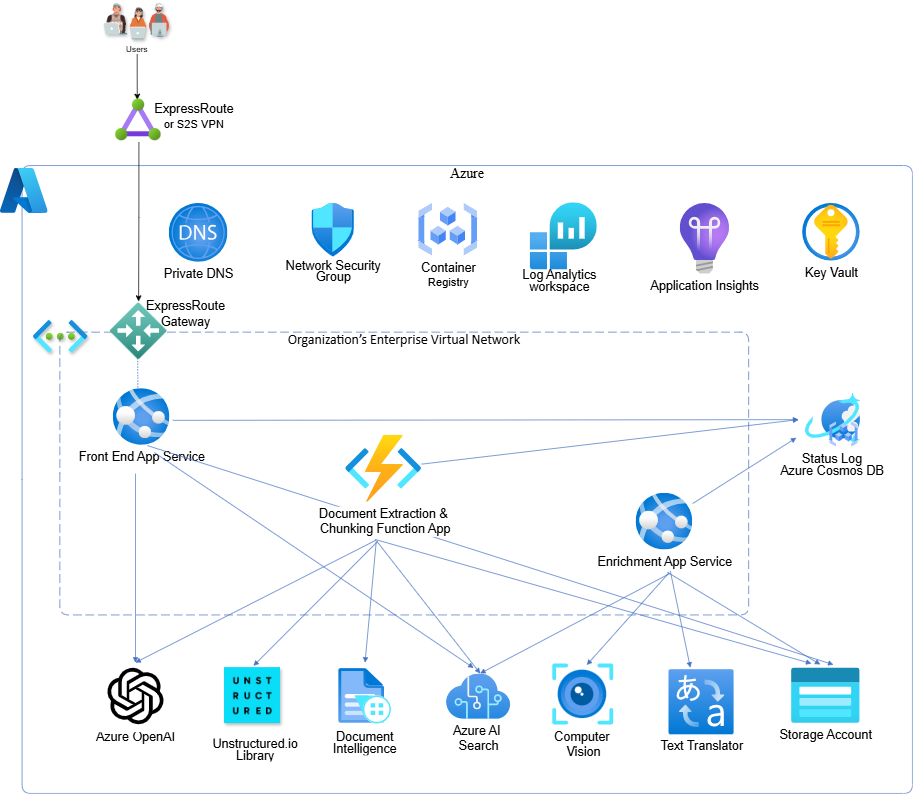

# Enable Secure Deployment

## Overview

> [!IMPORTANT]  
> The Information Assistant secure deployment option assumes clients have or will establish secure communications from their enterprise to the Azure cloud that will enable users to access Information Assistant capabilities. The secure communication mechanism is represented in this high level architecture diagram with ExpressRoute although there are other options for securely communicating with Azure. Azure ExpressRoute helps protect data during communication between your enterprise and Microsoft cloud services using private, dedicated links improving security and reliability.
Notes: Secure deployment is __not supported when using existing Azure OpenAI Services__. Secure deployment will create a DDOS Protection Plan for Virtual Network Protection. There is a limit of 1 DDOS protection plan for a subscription in a region. As part of security hardening Diagnostic Settings will be enabled. There is a limit of 5 diagnostic settings per subscription. A secure deployment will check capacity for DDOS and Diagnostic Settings. You may need to provide DDOS protection plan information or delete an existing Diagnostic Setting for Information Assistant to successfully deploy.

A secure deployment of the Information Assistant is essential when heightened levels of infrastructure security are necessary. Secure mode should be enabled for all production systems. Key features of a secure deployment include:

* __Disabling Public Network Access__: Restrict external access to safeguard sensitive data.
* __Virtual Network Protection__: Shield your system within a secure virtual network.
* __Data Encryption at Rest and in Transit__: Ensure confidentiality by encrypting data both when stored and during transmission.
* __Integration via Private Endpoints__: All Azure services connect exclusively through private endpoints within a virtual network

The secure deployment will add several new Azure resources and will likely require additional Azure permissions. New resources will include:

* Azure Monitor
* Network Security Group (NSG)
* Private DNS Zone
* Private Endpoint
* Private Link
* Virtual Network (vnet)

## Architecture

High level architecture diagram:



A more detailed architecture diagram shows the Information Assistant deployment in a single resource group within a subscription in your tenant and illustrates user interaction with underlying services:


If your enterprise lacks a secure communication channel between your enterprise and the Azure cloud, consider setting up a Point-to-Site (P2S) Virtual Private Network (VPN). This will allow you to enable access to the Information Assistant for demonstration purposes. To implement this approach, you’ll need to add a VPN Gateway to the Information Assistant infrastructure.

More information on [using an Azure VPN Gateway Point-to-Site VPN](https://learn.microsoft.com/en-us/azure/vpn-gateway/work-remotely-support)

Detailed information on how to [create and manage a VPN Gateway is available at learn.microsoft.com](https://learn.microsoft.com/en-us/azure/vpn-gateway/tutorial-create-gateway-portal)

After setting up a VPN Gateway, [configure the Azure VPN Client on your local machine](https://learn.microsoft.com/en-us/azure/vpn-gateway/openvpn-azure-ad-client)

### Secure deployment - Optional Features

For more complex scenarios, explore [Azure Front Door](https://learn.microsoft.com/en-us/azure/frontdoor/). Keep in mind that while Azure Front Door is suitable for basic access to the Information Assistant website, it is not designed for managing deployments and updates to the accelerator.

## Front end

When secure mode is enabled a private network is created called a virtual network. Services deployed within the same virtual network communicate securely. This additional level of isolation helps prevent unauthorized external access to services and helps protect your data. The diagram below shows an end user's interaction with Information Assistant and the subsequent front-end application's orchestration of the user's workflow. The front-end uses virtual network integration to connect to the private network and private DNS zones to connect to the appropriate services such as:

* __Azure Storage Account (Blob Storage)__: Used for file uploads.
* __Azure OpenAI__: Enables prompt submissions.
* __Azure AI Search__: Facilitates content discovery from uploaded files.
* __Cosmos DB__: Provides visibility into the status of uploaded files.


## Back end

Back-end processing handles uploading your private data, document extraction and enrichment leveraging AI Services as illustrated in the following diagram:


## How to Enable a Secure Deployment

To enable a Secure Deployment, update your local.env file as described below:

1. Open your forked repository in VSCode.
2. Navigate to the `scripts/environments/local.env` file
3. Update the following settings:

   ```bash
   export SECURE_MODE=true
   export USE_EXISTING_AOAI=false
   ```

   *Note: Secure Mode is blocked when using an existing Azure OpenAI service. We have blocked this scenario to prevent a deployment from restricting access to a shared instance of Azure OpenAI that may be in use by other workloads*

## Additional Considerations for Secure Deployment

The secure deployment defines a virtual network and multiple subnets, one for each service improving network isolation and data protection. Internet Protocol (IP) addresses and the corresponding Classess Inter-Domain Routing (CIDR)s are made available as Terraform parameters. Update the virtual network IP Addresses or CIDRs to avoid conflicts with your existing network(s), then copy this block of variables into your `scripts/environments/local.env` file (*values shown are default values*)

```bash
export TF_VAR_virtual_network_CIDR="10.0.0.0/21"
export TF_VAR_azure_monitor_CIDR="10.0.0.64/26"
export TF_VAR_storage_account_CIDR="10.0.1.0/26"
export TF_VAR_cosmos_db_CIDR="10.0.1.64/26"
export TF_VAR_azure_ai_CIDR="10.0.1.128/26"
export TF_VAR_key_vault_CIDR="10.0.1.192/26"
export TF_VAR_webapp_inbound_CIDR="10.0.2.0/26"
export TF_VAR_webapp_outbound_CIDR="10.0.2.128/26"
export TF_VAR_functions_inbound_CIDR="10.0.3.0/26"
export TF_VAR_functions_outbound_CIDR="10.0.3.128/26"
export TF_VAR_enrichment_app_inbound_CIDR="10.0.4.0/26"
export TF_VAR_enrichment_app_outbound_CIDR="10.0.4.128/26"
export TF_VAR_search_service_CIDR="10.0.5.0/26"
export TF_VAR_azure_video_indexer_CIDR="10.0.5.128/26"
export TF_VAR_bing_service_CIDR="10.0.6.0/26"
export TF_VAR_azure_openAI_CIDR="10.0.6.128/26"
```
