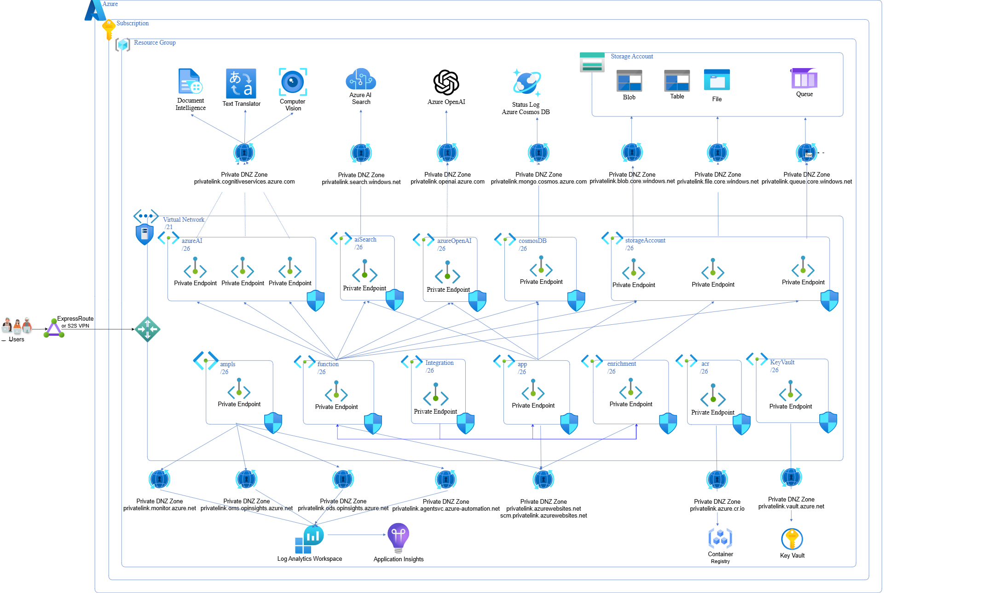

# Enable Secure Deployment

## Overview

> [!IMPORTANT]  
> The Information Assistant secure mode option assumes clients have or will establish secure communications from their enterprise to the Azure cloud that will enable users to access Information Assistant capabilities. The secure communication mechanism is represented in this high level architecture diagram with ExpressRoute although there are other options for securely communicating with Azure. Azure ExpressRoute helps protect data during communication.
>
>Notes: 
>
>* Secure mode is not supported with use existing Azure OpenAI Services.
>* Secure mode is not supported when you enable web chat.
>* Secure mode is not supported when you enable sharepoint connector.
>* Secure mode is not supported when you enable multimedia.
>* Secure mode will create a DDOS Protection Plan for Virtual Network Protection. There is a limit of 1 DDOS protection plan for a subscription in a region.
>* As part of security hardening Diagnostic Settings will be enabled. There is a limit of 5 diagnostic settings per subscription.
>* A secure mode will check capacity for DDOS and Diagnostic Settings.
>* You may need to provide DDOS protection plan information or delete an existing Diagnostic Setting for Information Assistant to successfully deploy in secure mode.
>
>


Information Assistant secure mode is essential when heightened levels of security are necessary. Secure mode should be enabled for all production systems. Key features of a secure mode include:

* __Disabling Public Network Access__: Restrict external access to safeguard sensitive data.
* __Virtual Network Protection__: Shield your system within a secure virtual network.
* __Data Encryption at Rest and in Transit__: Ensure confidentiality by encrypting data both when stored and during transmission.
* __Integration via Private Endpoints__: All Azure services connect exclusively through private endpoints within a virtual network

The secure mode adds several new Azure resources and will likely require additional Azure permissions. New resources will include:

* Azure Monitor
* Network Security Group (NSG)
* Private DNS Zone
* Private Endpoint
* Private Link
* Virtual Network (vnet)

## Architecture

Secure mode builds on the Single Virtual Network Pattern in which all components of your workload are inside a single virtual network (VNet). This pattern is possible if you're operating in a single region. A virtual network can't span multiple regions. The virtual network isolates your resources and traffic from other VNets and provides a boundary for applying security policies. Services deployed within the same virtual network communicate securely. This additional level of isolation helps prevent unauthorized external access to services and helps protect your data. 

High level architecture diagram:


Deploying a dedicated Azure service into your virtual network provides the following capabilities:

* Resources within the virtual network can communicate with each other privately, through private IP addresses.
* On-premises resources can access resources in a virtual network using private IP addresses over a Site-to-Site VPN (VPN Gateway) or ExpressRoute.
* Virtual networks can be peered to enable resources in the virtual networks to communicate with each other, using private IP addresses.
* The Azure service fully manages service instances in a virtual network. This management includes monitoring the health of the resources and scaling with load.
* Private endpoints allow ingress of traffic from your virtual network to an Azure resource securely.

The detailed architecture diagram below shows the VNet is subdivided into subnets that further segment network resources, allowing more granular control of network traffic and security fules. These subnets contain Private Endpoints, network interfaces that connect privately and securely to Azure Services. By using a Private IP address from your VNet, a Private Endpoint brings the service into your VNet, reducing exposure to the public internet. This improves network security through:

1. Network isolation: VNets and Subnets provide a segregated environment where only authorized resources can communicate with each other.
2. Reduced Attack Surface: Private Endp;oints ensure that Azure services are accessed via the private IP space of you VNet, not over the public internet, which significantly reduces the risk of external attacks.
3. Granular Access Control: NEtowkr SEcurity Groups (NSGs) can be associated with subnets and network interfaces to filter network traffic to and from resources within a VNet. This allwos for fune-tuned control over access and security policies.

The Information Assistant deploys to a resource group within a subscription in your tenant. The deployment requires a secure communication channel to complete successfully, as illustrated by the ExpreseRoute or S2S VPN for user access to the Virtual Network (vNet) on the left side of the diagram.


If your enterprise does not have an existing secure communication channel to the Azure cloud, consider setting up a Point-to-Site (P2S) Virtual Private Network (VPN) for demonstration purposes only. This will allow you to access the Information Assistant user experience (UX). To implement this for demonstration purposes, you’ll need to add a VPN Gateway to the Information Assistant infrastructure by creating a gateway subnet and a VPN Gateway then downloading a VPN client and connecting it to the VIP Gateway to access resources on the virtual network (vNet).

More information on [using an Azure VPN Gateway Point-to-Site VPN](https://learn.microsoft.com/en-us/azure/vpn-gateway/work-remotely-support)

Detailed information on how to [create and manage a VPN Gateway is available at learn.microsoft.com](https://learn.microsoft.com/en-us/azure/vpn-gateway/tutorial-create-gateway-portal)

After setting up a VPN Gateway, [configure the Azure VPN Client on your local machine](https://learn.microsoft.com/en-us/azure/vpn-gateway/openvpn-azure-ad-client)


## Front end

 The user experience is provided by a front-end application deployed as an App Service and associated with an App Service Plan. When the front-end application needs to securely communicate with resources in the VNet, the outbound calls from the front-end application are enabled through VNet integration ensuring that traffic is sent over the private network where private DNS zones resolve names to private VNet IP addresses. The diagram below shows user's securely connecting to the VNet to interact with the Information Assistant user experience (UX)in the App Subnet.
 
 The front-end application uses VNet integration to connect to the private network and private DNS zones to acceess the appropriate services such as:

* __Azure Storage Account (Blob Storage)__: Used for file uploads.
* __Azure OpenAI__: Enables prompt submissions.
* __Azure AI Search__: Facilitates content discovery from uploaded files.
* __Cosmos DB__: Provides visibility into the status of uploaded files.


## Back end

Back-end processing handles uploading your private data, performs document extraction and enrichment leveraging AI Services as illustrated in the following diagram:


## How to Enable a Secure Deployment

To enable a Secure Deployment, update your local.env file as described below:

1. Open your forked repository in VSCode.
2. Navigate to the `scripts/environments/local.env` file
3. Update the following settings:

   ```bash
   export SECURE_MODE=true
   export ENABLE_WEB_CHAT=false
   export USE_EXISTING_AOAI=false
   export ENABLE_SHAREPOINT_CONNECTOR=false
   export ENABLE_MULTIMEDIA=false
   ```

   *Note: Secure mode is blocked when using an existing Azure OpenAI service. We have blocked this scenario to prevent a deployment from restricting access to a shared instance of Azure OpenAI that may be in use by other workloads*

## Additional Considerations for Secure Deployment

Secure mode creates a virtual network and multiple subnets, improving network isolation and data protection. Internet Protocol (IP) addresses and the corresponding Classess Inter-Domain Routing (CIDR)s are available as Terraform parameters. To avoid any IP address conflicts with your existing network(s), update the virtual network IP Addresses or CIDRs, then copy this block of variables into your `scripts/environments/local.env` file (*values shown are default values*)

```bash
export TF_VAR_virtual_network_CIDR="10.0.0.0/21"
export TF_VAR_azure_monitor_CIDR="10.0.0.64/26"
export TF_VAR_storage_account_CIDR="10.0.1.0/26"
export TF_VAR_cosmos_db_CIDR="10.0.1.64/26"
export TF_VAR_azure_ai_CIDR="10.0.1.128/26"
export TF_VAR_key_vault_CIDR="10.0.1.192/26"
export TF_VAR_webapp_inbound_CIDR="10.0.2.0/26"
export TF_VAR_webapp_outbound_CIDR="10.0.2.128/26"
export TF_VAR_functions_inbound_CIDR="10.0.3.0/26"
export TF_VAR_functions_outbound_CIDR="10.0.3.128/26"
export TF_VAR_enrichment_app_inbound_CIDR="10.0.4.0/26"
export TF_VAR_enrichment_app_outbound_CIDR="10.0.4.128/26"
export TF_VAR_search_service_CIDR="10.0.5.0/26"
export TF_VAR_azure_video_indexer_CIDR="10.0.5.128/26"
export TF_VAR_bing_service_CIDR="10.0.6.0/26"
export TF_VAR_azure_openAI_CIDR="10.0.6.128/26"
```

The network architecture diagram below contains additional details on Private Endpoints and Private Links. A Private Link provides access to services over the Private Endpoint network interface. Private Endpoint uses a private IP address from your virtual network. You can access various services over that private IP address such as:

*	Azure PaaS services like Azure OpenAI and Azure AI Search
*	Customer-owned services that Azure hosts
*	Partner services that Azure hosts

Traffic between your virtual network and the service that you're accessing travels across the Azure network backbone. As a result, you no longer access the service over a public endpoint, effectively reducing exposure and enhancing security.

