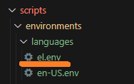

# Configuring your own language ENV file

Within the IA Accelerator you can customize the language settings of the search index, search skillsets, and Azure OpenAI prompts. To do this you must create a language ENV file in the `scripts/environments/languages` folder. This documentation will explain how to set up your own language file.

## Mapping to your custom language ENV file for deployment

The first step in configuring a language for the IA Accelerator is to create a new language ENV file in the `scripts/environments/languages` folder. Simply add a new file in this folder and remember the name of the file you create. In this example, we have created a language ENV file for the Greek language (`el.env`).



Once you have created your language ENV file, we need to map to this file from `scripts/environments/local.env`. In this file find the setting named `DEFAULT_LANGUAGE` and set the value to match the file name you created above without the extension.

``` makefile
export DEFAULT_LANGUAGE="el"
```

## Populating your custom language ENV file

The next step is to populate the required values of your custom language ENV file. You can get a template of contents from `scripts/environments/languages/language.env.example`. The required values are:

Parameter | Description
---|---
PROMPT_QUERYTERM_LANGUAGE | The language that Azure OpenAI will be prompted to generate the search terms in. This is used in the natural language prompt so example values would be "English" or "Greek".
SEARCH_INDEX_ANALYZER | The analyzer that the search index will use for all "searchable" fields except "translated_text". Supported analyzers can be found at <https://learn.microsoft.com/en-us/azure/search/index-add-language-analyzers#language-analyzer-list>
SEARCH_INDEX_TRANSLATED_TEXT_ANALYZER | The analyzer that the search index will use for the translated text field. Supported analyzers can be found at <https://learn.microsoft.com/en-us/azure/search/index-add-language-analyzers#language-analyzer-list>
ACS_ENTITY_RECOGNITION_SKILL_LANGUAGE | The language that the cognitive search skillset will use for entity recognition. Supported languages can be found at <https://learn.microsoft.com/en-us/azure/cognitive-services/language-service/named-entity-recognition/language-support>
ACS_KEY_PHRASE_EXTRACTION_SKILL_LANGUAGE | The language that the cognitive search skillset will use for key phrase extraction. Supported languages can be found at <https://learn.microsoft.com/en-us/azure/cognitive-services/language-service/key-phrase-extraction/language-support>
ACS_TEXT_TRANSLATION_SKILL_FROM_LANGUAGE <br/>ACS_TEXT_TRANSLATION_SKILL_TO_LANGUAGE | The language that the cognitive search skillset will use for text translation from and to. Supported Languages can be found at <https://learn.microsoft.com/en-us/azure/cognitive-services/translator/language-support>
ACS_PII_DETECTION_SKILL_LANGUAGE | The language that the cognitive search skillset will use for PII detection. Supported languages can be found at <https://learn.microsoft.com/en-us/azure/cognitive-services/language-service/personally-identifiable-information/language-support?tabs=documents>
ACS_TEXT_SPLITTING_SKILL_LANGUAGE | The language that the cognitive search skillset will use for text splitting. Supported languages can be found at <https://learn.microsoft.com/en-us/azure/search/cognitive-search-skill-textsplit#skill-parameters>
ACS_OCR_SKILL_LANGUAGE | The language that the cognitive search skillset will use for OCR. Supported languages can be found at <https://learn.microsoft.com/en-us/azure/cognitive-services/computer-vision/language-support#image-analysis>
ACS_IMAGE_ANALYSIS_SKILL_LANGUAGE | The language that the cognitive search skillset will use for image analysis. Supported languages can be found at <https://learn.microsoft.com/en-us/azure/cognitive-services/computer-vision/language-support#image-analysis>
TARGET_TRANSLATION_LANGUAGE | The language that the cognitive service will use to translate text to if required. Supported languages and associatted codes can be found at <https://learn.microsoft.com/en-us/azure/ai-services/translator/language-support>

*NOTE: It is important that all parameters have a value. In some cases your language of choice may not be available for one or more options, you must choose a supported value. In our example, for the Greek language, not all values were supported in Greek so we used English where Greek was not supported.*
