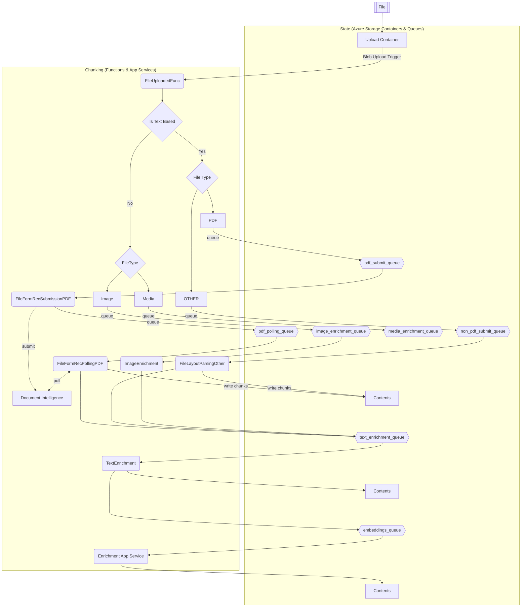

# Document Pre-processing
The Information Assistant relies on a multi-step process to preprocess documents in preparation for them being used in the NLP based chat interface. 
The pre-processing of documents is a crucial step as it involves several steps, such as text extraction and normalizing the text, to convert the raw data into a format that can be easily analyzed by the OpenAI model. Information Assistant preprocess different types of documents, ensuring that the text is cleaned and processed effectively for better understanding and analysis of large complex documents.

## PDF Document Pre-Processing

PDF documents often contain a mix of text, images, and other media, which requires a series of steps to extract and process the relevant information.
For PDF's we use a service, known as [Azure AI Document Intelligence](https://learn.microsoft.com/en-us/azure/ai-services/document-intelligence/overview?view=doc-intel-3.1.0). Azure AI Document Intelligence 'cracks' a PDF file and process each page using the Layout API. It provides a JSON representation of the file including titles, sub-headings, headers, footers, tables and content paragraphs. We take this content and build a standardized JSON 'document map' of the content.

## Document Pre-Processing

[Unstructured.io](https://unstructured.io/) supports various document types, including 'docx', 'html', 'htm', 'csv', 'md', 'pptx', 'txt', 'json', 'xlsx', 'xml', 'eml', and 'msg'. Like Azure AI Document Intelligence for PDFs, we create a 'document map' of the content, which serves as a JSON-based representation.

## Image Pre-Processing

Image processing for 'jpg', 'jpeg', 'png', 'gif', 'bmp', 'tif', and 'tiff' formats. Leveraging Azure's GPU optionally in regions where [available](https://learn.microsoft.com/en-us/azure/container-instances/container-instances-region-availability) to generate Captions and Deep Captions. We utilize the Cognitive Services [Computer Vision API](https://azure.microsoft.com/en-us/resources/cloud-computing-dictionary/what-is-computer-vision/?ef_id=_k_f4f6deceb1b41be24ecebbf7bfa0a48b_k_&OCID=AIDcmme9zx2qiz_SEM__k_f4f6deceb1b41be24ecebbf7bfa0a48b_k_&msclkid=f4f6deceb1b41be24ecebbf7bfa0a48b#object-classification) to generate descriptions and perform OCR on any text present within these image files. A JSON model of this data is then generated the same as with other document types.

## Detailed Flow of Pre-Processing 

In this section we explore the pre-processing flow in more detail, to enable you to understand the patterns employed and how you may adapt the configuration to meet your own needs. Below is a graphic representing the flow steps..

Initially files are uploaded manually, or via the UI, to the upload container in your Azure Storage Account. The action of completing the upload triggers the first function in the chain, **FileUploadedFunc**. This function is responsible for reading the file in and determining the type of file, PDF, DocX, HTML etc. It will then post a message to the **non-pdf-submit-queue** or **pdf-submit-queue** depending on the file type. This will then allow these files to be processed differently depending on their type.

### Text based files

We have 2 paths for text based files because we extract the content and build a map of the files content, titles, headers, paragraphs and tables etc. differently depending on the file type. For PDF's we use a service, known as [Azure AI Document Intelligence](https://learn.microsoft.com/en-us/azure/ai-services/document-intelligence/overview?view=doc-intel-3.1.0). Azure AI Document Intelligence 'cracks' a PDF file and processes each page using the Layout API. It provides a JSON representation of the file including titles, sub-headings, headers, footers, tables and content paragraphs. We take this content and build a standardized JSON 'document map' of the content. There are various API versions, so feel free to explore these in the [Azure AI Document Intelligence Studio](https://documentintelligence.ai.azure.com/studio) and implement whichever works best for your scenario.

With other text based file types, we use a library called [Unstructured.io](https://unstructured.io/) to extract text content from various file typs and chunk the files. [Unstructured.io](https://unstructured.io/) releases updates to this library so feel free to test newer versions if you require enhanced functionality.

Listening to the **pdf-submit-queue** is a function called **FileFormRecSubmissionPDF**. This will pick up the PDF file and try to submit it to Azure Form Recognizer for processing. If this is successful it will receive an ID from Azure Form Recognizer which can be used to poll Azure Form Recognizer to receive the processed results once processing is completed. At the point it will submit a message indicating this information to the **pdf-polling-queue**. If it is not successful, a message is sent back to the **pdf-submit-queue**. However, this message is configured to not be visible to the function to pick up again for delay period specified in the function, which increases exponentially up to a maximum delay and maximum number of retries.

This pattern of trying to submit a PDF to the Azure Form Recognizer service, and then passing back to the queue if there is a failure is a necessity to compensate for the throttling limitations inherent with Azure Form Recognizer. By default the maximum throughput possible is [15 transactions per second](https://learn.microsoft.com/en-us/azure/applied-ai-services/form-recognizer/service-limits?view=form-recog-3.0.0). If you submit 100 documents at the same time there would be failures without this approach. 

Now that the message is in the **pdf-polling-queue**, the next function picks this message up and attempts to process it. The **FileFormRecPollingPDF** reaches out to [Azure AI Document Intelligence](https://learn.microsoft.com/en-us/azure/ai-services/document-intelligence/overview?view=doc-intel-3.1.0) with the id of the process and attempts to retrieve the results. if the service is still processing, which can take minutes for large files, the function closes down and the message returns to the queue with a delay before the function picks up the message and retries. Again, after a maximum number of retries, the document will be logged with a status or error. If the results are received, then the function will create the document map, a standard representation of the document, and this is then passed to the shared code functions to generate chunks.

We use this 2 function polling and queue pattern, rather than the SDK which uses polling also, because the processing of the PDF file can take multiple minutes. This prevents us than having an Azure Function running and just waiting, or failing if the time is too much.

When PDF and non-PDF processing is complete, chunks are written to the Content container in your Azure Storage Account and the message is passed onto the next queue, the text_enrichment_queue. The next function in the chain is the TextEnrichment function, which picks up the message and retrieves the associatted chunks. It determines the primary language of the text by sampling the first few chunks using the [Microsoft Cognitive Servcices to detect the language.](https://learn.microsoft.com/en-us/azure/ai-services/language-service/language-detection/overview). It then iterates through the chunks and translates the textual content. Finally it writes the message to the next queue, which is the embeddings_queue.

The final step in preprocessing is where the Embeddings App Service picks up the message form the embeddings_qeueue and processes it. This involves creating embeddings to enable vector based search. It generates these embeddings of the textual content of each chunk using the Azure OpenAI model or an open source model depending on your configuration and writes these back to the chunk. Finally we need to make the enriched chunks available to be searched via the Information Assistant application. To do this the Embeddings App Service pushes the relevant content over to the Azure Search Service Index where it will be available to be returned as part of the RAG process.

## Function & App Service Configuration

There are a number of settings that are configured during deployment, but which can also be updated through the configuration blade in the Azure Function App. Many of the settings relate to hard values, such as storage container names and endpoints for services, but we anticipate customers may wish to change certain configurations and these are described below.

Setting | Description
--- | ---
CHUNK_TARGET_SIZE | The number of tokens the function targets as the maximum per chunk text content to be generated. Additional metadata are added to the chunk JSON files as they are created that add roughly 180-200 tokens to the overall size of the chunk JSON file that gets indexed by Azure AI Search. So we recommend setting the **CHUNK_TARGET_SIZE** to your overall size target minus 200 tokens. 
MAX_SECONDS_HIDE_ON_UPLOAD | The maximum number of seconds a message will be hidden when initially submitting to the process. The actual time a message is invisible is a random value from 0 to this cap. This spreads out initial processing so as not to hit a throttling event unnecessarily
MAX_SUBMIT_REQUEUE_COUNT | The maximum number of times the process will try to process a PDF through Form Recognizer
PDF_SUBMIT_QUEUE_BACKOFF | The number of seconds a message will remain invisible after resubmitting to the queue due to throttling during submitting to Form Recognizer
POLL_QUEUE_SUBMIT_BACKOFF | How many seconds we will initially wait before trying to retrieve processed results form Form Recognizer
POLLING_BACKOFF | If, on polling the Form Recognizer service, we learn the request is still being processed, the flow will pass a new message back to the polling queue which will become visible after this number of seconds. The delay in visibility will increase from this initial value exponentially
MAX_READ_ATTEMPTS | The maximum number of times we will try to retrieve processed results from Azure Form Recognizer
MAX_POLLING_REQUEUE_COUNT | The maximum number of times the process will submit a message to the polling queue
SUBMIT_REQUEUE_HIDE_SECONDS | If a throttling event occurs on upload, the message will be resubmitted to the queue up to a maximum amount of times specified in this setting
TARGET_TRANSLATION_LANGUAGE | The target language that the process will translate chunks into
ENRICHMENT_BACKOFF | The number of seconds a message will be invisible when resubmitted to the enrichment queue after a failure due to throttling. This will increase exponentially for every subsequent time a failure occurs
MAX_ENRICHMENT_REQUEUE_COUNT | The maximum number of times a message will be pushed to the enrichment queue after a failure in the enrichment function
TARGET_TRANSLATION_LANGUAGE | The language you wish all chunks to be translated to
FR_API_VERSION | The API version of [Azure AI Document Intelligence](https://learn.microsoft.com/en-us/azure/ai-services/document-intelligence/overview?view=doc-intel-3.1.0) which you wish to use

Likewise, below are some configuration values of the App Service that you may wish to adapt to your scenario

Setting | Description
--- | ---
MAX_EMBEDDING_REQUEUE_COUNT | The number of times you will retry the embeddings process following a failure due to a condition such as throttling. Note that a retry will pick up embeddings processing from where it failed last time, rather than starting fresh
TARGET_EMBEDDINGS_MODEL | The embeddings model you use should NOT be changed as a configuration setting only. This is used by the Information Assistant web application also and so these values need to be the same
EMBEDDING_VECTOR_SIZE | As with TARGET_EMBEDDINGS_MODEL this value must be consistent with Information Assistant web application and should not be changed through configuration as there will likely be a mismatch between chunks that have been embedded and the UI generating an embedded version of the users question
EMBEDDING_REQUEUE_BACKOFF | The number of seconds a message will be invisible when resubmitted to the queue after a failure. This will increase exponentially for every subsequent time a failure occurs

## References
- [Form Recognizer service quotas and limits](https://learn.microsoft.com/en-us/azure/applied-ai-services/form-recognizer/service-limits?view=form-recog-3.0.0)
- [Cognitive Services autoscale feature](https://learn.microsoft.com/en-us/azure/cognitive-services/autoscale?tabs=portal)
- [Form Recognizer 2023-02-28-preview API Reference](https://westus.dev.cognitive.microsoft.com/docs/services/form-recognizer-api-2023-02-28-preview/operations/AnalyzeDocument)
- [QueuesOptions.VisibilityTimeout Property](https://learn.microsoft.com/en-us/dotnet/api/microsoft.azure.webjobs.host.queuesoptions.visibilitytimeout?view=azure-dotnet)
