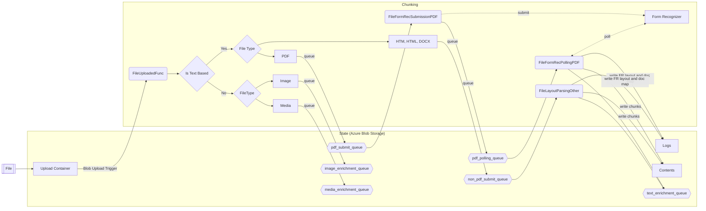

# Document Pre-processing
The Information Assistant relies on a multi-step process to preprocess documents in preparation for them being used in the NLP based chat interface. 
The pre-processing of documents is a crucial step as it involves several steps, such as text extraction and normalizing the text, to convert the raw data into a format that can be easily analyzed by the OpenAI model. Information Assistant preprocess different types of documents, ensuring that the text is cleaned and processed effectively for better understanding and analysis of large complex documents. 

## PDF Pre-Processing
PDF documents often contain a mix of text, images, and other media, which requires a series of steps to extract and process the relevant information.
For PDF's we use a service, known as Azure Form Recognizer. Azure Form Recognizer 'cracks' a PDF file and process each page using the Layout API. It provides a JSON representation of the file including titles, sub-headings, headers, footers, tables and content paragraphs. We take this content and build a standardized JSON 'document map' of the content.

## HTML/DOCX Pre-Processing
For HTML and docx documents, we firstly use a library called [Mammoth](https://pypi.org/project/mammoth/) to convert these to html format. Now that we have these all as HTML, we use another library, [Beautiful Soup](https://pypi.org/project/beautifulsoup4/), to extract titles, sub-headings, headers, footers, tables and content paragraphs, similarly to using Azure Form Recognizer for PDF's. Again we create a 'document map' of the content, a json based representation.

