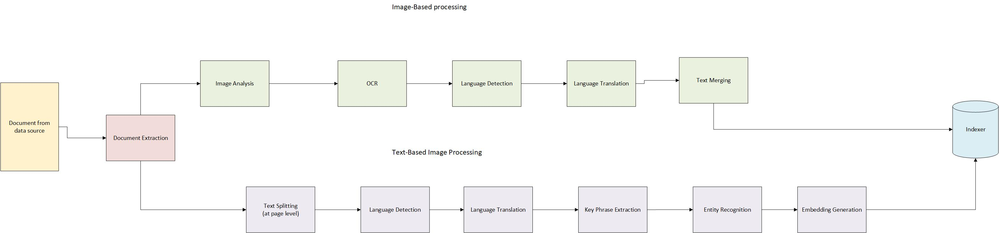

# Document Pre-processing

The Information Assistant relies on a multi-step process to pre-process documents in preparation for them being used in the NLP based chat interface.
The pre-processing of documents is a crucial step as it involves several steps, such as text extraction and normalizing the text, to convert the raw data into a format that can be easily analyzed by the OpenAI model. Information Assistant pre-process different types of documents, ensuring that the text is cleaned and processed effectively for better understanding and analysis of large complex documents.

## Document Pre-Processing

The document pre-processing involves several steps, including document extraction, text splitting, language detection, translation, key phrase extraction, entity recognition, and embedding generation. Below are the details of each step:

1. **Document Extraction**: Extracts content and metadata from documents.  
   - Defined in the skillset (see `create_skillset.json`) as `DocumentExtractionSkill`.
   - Uses the data source in [create_data_source.json](../azure_search/create_data_source.json) (`"type": "azureblob"`) to load files from the storage container.
   - Learn more: [DocumentExtractionSkill Documentation](https://learn.microsoft.com/en-us/azure/search/cognitive-search-skill-document-extraction)

2. **Text Splitting**: Splits the text into pages or sentences.  
   - Configured in `create_skillset.json` with the `SplitSkill` named `"Split"`.  
   - Learn more: [SplitSkill Documentation](https://learn.microsoft.com/azure/search/cognitive-search-skill-textsplit)

3. **Language Detection**: Detects the language of the text.  
   - Configured in `create_skillset.json` with the `LanguageDetectionSkill`.  
   - Learn more: [LanguageDetectionSkill Documentation](https://learn.microsoft.com/azure/search/cognitive-search-skill-language-detection)

4. **Translation**: Translates the text to the target language if needed.  
   - Configured using the `TranslationSkill` in `create_skillset.json`.  
   - Learn more: [TranslationSkill Documentation](https://learn.microsoft.com/azure/search/cognitive-search-skill-translation)

5. **Key Phrase Extraction**: Extracts key phrases from the text.  
   - Defined in the `KeyPhraseExtractionSkill` in `create_skillset.json`.  
   - Learn more: [KeyPhraseExtractionSkill Documentation](https://learn.microsoft.com/azure/search/cognitive-search-skill-keyphrases)

6. **Entity Recognition**: Recognizes named entities in the text.  
   - Defined in the `EntityRecognitionSkill` in `create_skillset.json`.  
   - Learn more: [EntityRecognitionSkill Documentation](https://learn.microsoft.com/azure/search/cognitive-search-skill-entity-recognition)

7. **Embedding Generation**: Generates embeddings for the text using Azure OpenAI.  
   - Configured in `create_skillset.json` as the `AzureOpenAIEmbeddingSkill`.  
   - The resulting embeddings are stored in the field `"contentVector"` in [create_vector_index.json](../azure_search/create_vector_index.json).  
   - Learn more: [Azure OpenAI Embeddings in Cognitive Search](https://learn.microsoft.com/azure/search/cognitive-search-aoai-embedding-skill)

## Image Pre-Processing

Images are sent to the normalized images path to be processed by the following skillsets:

1. **Image Analysis**: Analyzes images to extract tags, descriptions, faces, objects, and more.  
   - Defined in `create_skillset.json` as the `ImageAnalysisSkill`.  
   - Learn more: [ImageAnalysisSkill Documentation](https://learn.microsoft.com/azure/search/cognitive-search-skill-image-analysis)

2. **OCR**: Extracts text from images using Optical Character Recognition.  
   - Defined in `create_skillset.json` as the `OcrSkill`.  
   - Learn more: [OcrSkill Documentation](https://learn.microsoft.com/azure/search/cognitive-search-skill-ocr)

3. **Language Detection**: Detects the language of the extracted text.  
   - Defined in `create_skillset.json` (e.g., `"ocr language detection"`).  
   - Link: [LanguageDetectionSkill Documentation](https://learn.microsoft.com/azure/search/cognitive-search-skill-language-detection)

4. **Translation**: Translates the extracted text to the target language if needed.  
   - Defined in `create_skillset.json` (`"ocr translation"` skill).  
   - Link: [TranslationSkill Documentation](https://learn.microsoft.com/azure/search/cognitive-search-skill-translation)

5. **Text Merge**: Combines all the text extracted from the OCR and Image Analysis skills through multiple merge skill.  
   - Defined in `create_skillset.json` as the `TextMergeSkill`.  
   - This skill ensures that all extracted text is consolidated into a single, coherent text block for further processing and indexing.
   - Link: [TextMergeSkill Documentation](https://learn.microsoft.com/azure/search/cognitive-search-skill-textmerge)

## Detailed Flow of Pre-Processing

In this section we explore the pre-processing flow in more detail, to enable you to understand the patterns employed and how you may adapt the configuration to meet your own needs. Below is a graphic representing the flow steps..

Initially files are uploaded manually, or via the UI, to the upload container in your Azure Storage Account. The action of completing the upload adds the document to queue of documents to be processed by the indexer that runs every 30 minutes. The indexer then completes the set of skillsets and maps the output to the index to be queried using the chat application.

### Text based files

When text-based files are processed, the DocumentExtractionSkill first extracts content and metadata, followed by the SplitSkill (named “Split”) that chunks the extracted text into pages. Next, the language detection skill identifies the text language for each chunk while a ConditionalSkill (“language check”) decides if translation is needed via the TranslationSkill. The text is then finalized using another ConditionalSkill to merge either the original or translated content. Subsequently, the KeyPhraseExtractionSkill extracts key phrases, and the EntityRecognitionSkill identifies named entities. Finally, the AzureOpenAIEmbeddingSkill computes vector embeddings for each chunk, enabling vector-based search and retrieval in a Azure Search index.

### Image based files
When image-based files are processed, the ImageAnalysisSkill first analyzes the images to extract tags, descriptions, faces, objects, and more. Following this, the OcrSkill extracts text from the images using Optical Character Recognition (OCR). Next, the LanguageDetectionSkill identifies the language of the extracted text. If translation is needed, the TranslationSkill translates the extracted text to the target language. The processed text are merged together and the metadata are then stored in the index, enabling search and retrieval in the Azure Search index.

## AI Search Service Index Configuration

There are a number of settings that are configured during deployment. Many of the settings relate to hard values, such as storage container names and endpoints for services, but we anticipate customers may wish to change certain configurations and these are described below. Many of the settings relate to the data source (`"infoasst-azureblob-datasource"` defined in [create_data_source.json](../azure_search/create_data_source.json)), the indexer schedule and mapping (in [create_indexer.json](../azure_search/create_indexer.json)), and the fields with vector search (in [create_vector_index.json](../azure_search/create_vector_index.json)).  

Setting | Description
--- | ---
`type` | The type of the data source, e.g., `azureblob`.
`dataSourceName` | Points to the data source `"infoasst-azureblob-datasource"`.
`targetIndexName` | References `"vector-index"`.
`skillsetName` | References `"infoasst-skillset"` in `create_skillset.json`.
`schedule` | Set to `"interval": "PT30M"` so it runs every 30 minutes.

This framework allows for continuous and automated enrichment of all content stored in the configured Azure Blob container.

## References

- [Form Recognizer service quotas and limits](https://learn.microsoft.com/azure/applied-ai-services/form-recognizer/service-limits?view=form-recog-3.0.0)
- [Cognitive Services autoscale feature](https://learn.microsoft.com/azure/cognitive-services/autoscale?tabs=portal)
- [Form Recognizer 2023-02-28-preview API Reference](https://westus.dev.cognitive.microsoft.com/docs/services/form-recognizer-api-2023-02-28-preview/operations/AnalyzeDocument)
