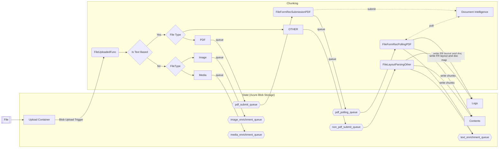

# Document Pre-processing
The Information Assistant relies on a multi-step process to preprocess documents in preparation for them being used in the NLP based chat interface. 
The pre-processing of documents is a crucial step as it involves several steps, such as text extraction and normalizing the text, to convert the raw data into a format that can be easily analyzed by the OpenAI model. Information Assistant preprocess different types of documents, ensuring that the text is cleaned and processed effectively for better understanding and analysis of large complex documents. 

## PDF Document Pre-Processing
PDF documents often contain a mix of text, images, and other media, which requires a series of steps to extract and process the relevant information.
For PDF's we use a service, known as Azure Document Intelligence. Azure Document Intelligence 'cracks' a PDF file and process each page using the Layout API. It provides a JSON representation of the file including titles, sub-headings, headers, footers, tables and content paragraphs. We take this content and build a standardized JSON 'document map' of the content.

## Document Pre-Processing
For HTML and docx documents, we leverage the capabilities of [Unstructured.io](https://unstructured.io/) for conversion to HTML format and subsequent content extraction. Unstructured.io supports various additional document types, including 'htm', 'csv', 'md', 'pptx', 'txt', 'xlsx', 'xml', 'eml', and 'msg'. Like Azure Document Intelligence for PDFs, we create a 'document map' of the content, which serves as a JSON-based representation.

## Image Pre-Processing
Image processing for 'jpg', 'jpeg', 'png', 'gif', 'bmp', 'tif', and 'tiff' formats. Leveraging Azure's GPU optionally in regions where available (East US, France Central, Korea Central, North Europe, Southeast Asia, West Europe, West US) to generate Captions and Deep Captions. We utilize the Cognitive Services Computer Vision API to generate descriptions and perform OCR on any text present within these image files. A json model of this data is then generated the same as with other document types.

