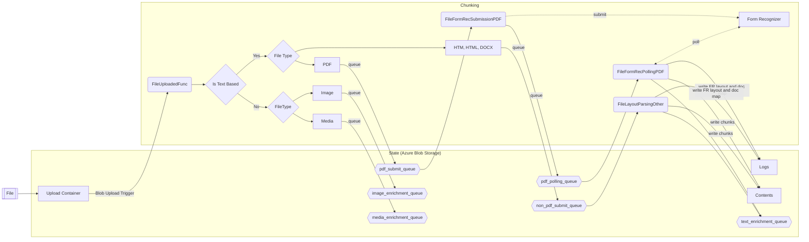

# Document Pre-processing
The pre-processing of documents is a crucial step in the text analysis pipeline. It involves several steps, such as extracting text, tokenizing, cleaning, and normalizing the text, to convert the raw data into a format that can be easily analyzed by the OpenAI model. Information Assistant preprocess different types of documents, ensuring that the text is cleaned and processed effectively for better understanding and analysis of large complex documents. 

## PDF Pre-Processing
PDF documents often contain a mix of text, images, and other media, which requires a series of steps to extract and process the relevant information.

- Text Extraction: Azure OpenAI uses Optical Character Recognition (OCR) technology to extract text from images and scanned documents within the PDF. This ensures that all textual content, regardless of its format, is extracted for further processing.

- Tokenization: The extracted text is then tokenized into smaller parts called tokens, which can be words or subwords. This step is essential for the OpenAI model to understand the structure and meaning of the text.

- Text Cleaning: This involves removing any noise from the text, such as special characters, punctuation, and irrelevant whitespaces.

- Normalization: All characters are converted to lowercase, and stemming or lemmatization is applied to reduce words to their base form.

The processed text is then fed into the OpenAI model for further analysis.

## HTML Pre-Processing
HTML documents contain a lot of irrelevant information, such as HTML tags, scripts, and styling information, which need to be removed before processing the text.

- Web Scraping: Azure OpenAI uses web scraping techniques to extract the relevant text from the HTML document, discarding any irrelevant content such as HTML tags, scripts, and styling information.

- Tokenization: Similar to PDF documents, the extracted text is then tokenized into smaller parts, which can be words or subwords.

- Text Cleaning: The text is cleaned by removing any noise, such as special characters, punctuation, and irrelevant whitespaces.

- Normalization: All characters are converted to lowercase, and stemming or lemmatization is applied to reduce words to their base form.

The cleaned and processed text is then used for further analysis by the OpenAI model.

## DOCX
DOCX is a proprietary document format used by Microsoft Word, and requires specialized libraries to extract text and other relevant information.

- Text Extraction: Azure OpenAI uses specialized libraries like python-docx to extract text and other relevant information from the DOCX documents.

- Tokenization: The extracted text is then tokenized into smaller parts, which can be words or subwords.

- Text Cleaning: The text is cleaned by removing any noise, such as special characters, punctuation, and irrelevant whitespaces.

- Normalization: All characters are converted to lowercase, and stemming or lemmatization is applied to reduce words to their base form.

The processed text is then fed into the OpenAI model for further analysis.

