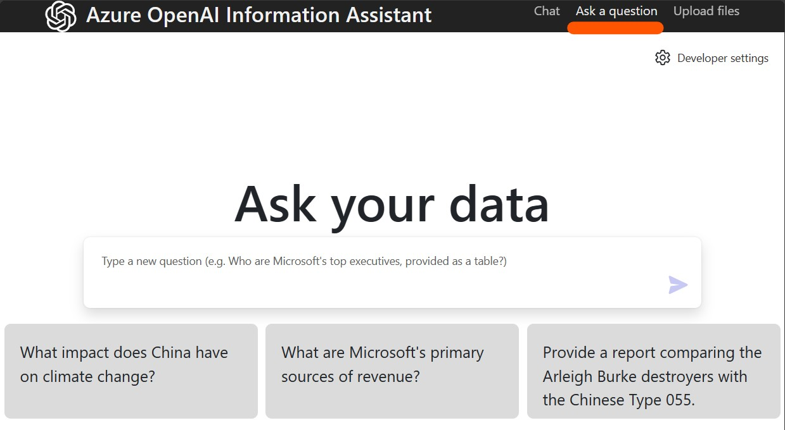
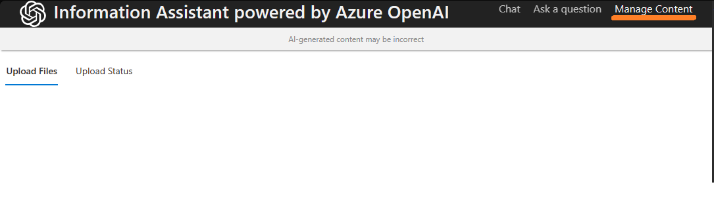
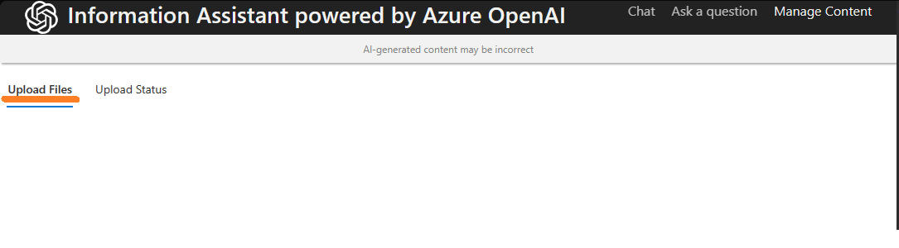
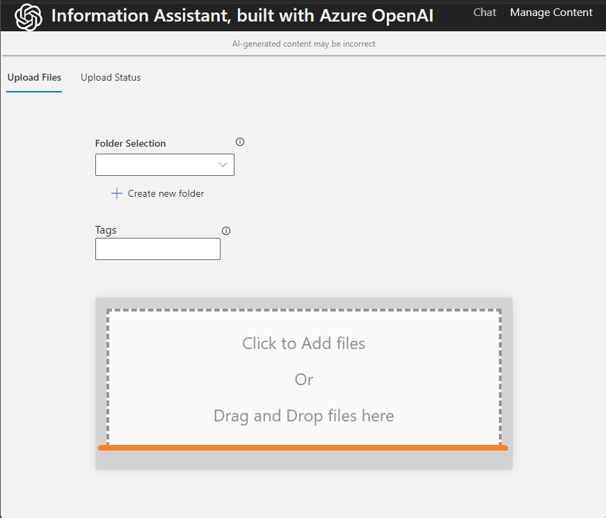
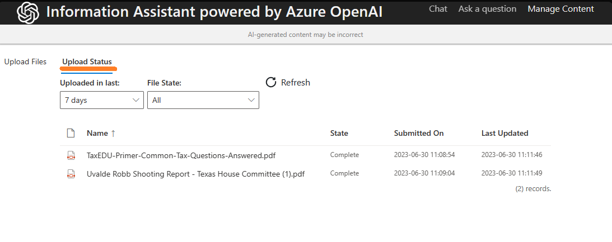
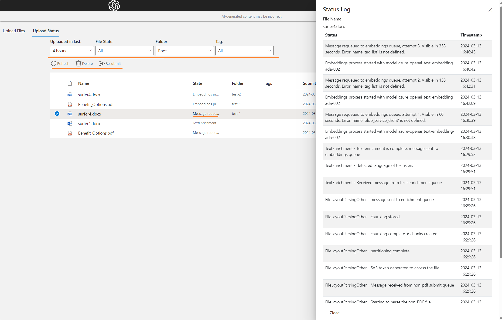

# PS Info Assistant Features

* [Document Pre-Processing](#document-pre-processing)
* [User Experience](#user-experience)
  * [Having a conversation with your Private Data](#having-a-conversation-with-your-data)
  * [Ask your data](#ask-your-data)
  * [Analysis Panel](#analysis-panel)
  * [Manage Content](#manage-content)
    * [Uploading files](#uploading-files)
    * [View upload status](#view-upload-status)
* [Developer Settings](#developer-settings)
  * [Configuring your own language ENV file]()
  * [Debugging Functions](#debugging-functions)
  * [Build pipeline for sandbox environment](#build-pipeline-for-sandbox)
  * [Customer Usage Attribution](#customer-usage-attribution)

---

## Document Pre-processing

The Information Assistant Accelerator pre-processes certain document types to allow better understanding of large complex documents. Currently we apply special processing on:

* [PDF](document_pre_processing.md#pdf-pre-processing)
* [HTML](document_pre_processing.md#html-pre-processing)
* [DOCX](document_pre_processing.md#docx-pre-processing)

For more details on how we process each document type click on on the document type in the list above.

We also log the status of the pre-processing in Azure Cosmos DB. View our [Status Logging](../../functions/shared_code/status_log.md) page for more details.

Additionally, there are many configuration values that can be altered to effect the performance and behaviors of the chunking patterns. More details on the deployment configurations can be found in our [Function Flow documentation](../functions_flow.md)

## User Experience

The end user leverages the web interface as the primary method to engage with the IA Accelerator, and the Azure OpenAI service. The user interface is very similar to that of the OpenAI ChatGPT interface, though it provides different and additional functionality which is outlined below.

### Having a conversation with your data

When you engage with IA Accelerator in the "Chat" method, the system maintains a history for your conversation and will be able to understand the context of your questions from one question to the next.

> You may activate the Chat engagement pattern by choosing the "Chat" link at the top of the page
> 

### Ask your data

When you engage with IA Accelerator in the "Ask a question" method, the system does not maintain a history for your conversation. Each question will be treated with on its own as a new and unique query.

> You may activate the **Ask a question** engagement pattern by choosing the "Chat" link at the top of the page
> 

### Analysis Panel

The Analysis Panel in the UX allows the user to explore three details about the answer to their question:

* Thought Process
* Supporting Content
* [Citations](./ux_analysispanel.md#citations)

View the details of the [Analysis Panel](./ux_analysispanel.md) feature or you can click on each section to get more specifics of that detail tab.

### Manage Content

When you engage with IA Accelerator in the "Manage Content" method, the system allows you to add new content and see the status of processing for content previously loaded into the IA Accelerator.

> You may activate the Manage Content engagement pattern by choosing the "Manage Content" link at the top of the page
> 

#### Uploading files

You can upload documents in the [supported formats listed above](#document-pre-processing) through the user interface. To do so:

> 1. Click on the Manage Content link in the top of the interface
> 
> 1. Then click on the "Upload files" tab.
> 
> 1. Drag files to the user interface, or click to open a browse window
> 

#### View upload status

You can view the status up files that have been uploaded to the system through the user interface. To do so:

> 1. Click on the Manage Content link in the top of the interface
> 
> 1. Then click on the "Upload Status" tab.
> 
> 1. Select options and **Refresh** the view. The options defaults to *4 hours* Timespan and *All* File Status. 
> 

## Developer Settings

### Configuring your own language ENV file

At deployment time, you can alter the behavior of the IA Accelerator to use a language of your choosing across it's Azure Cognitive Search and Azure OpenAI prompting. See [Configuring your own language ENV file](./configuring_language_env_files.md) more information.

### Debugging functions

Check out how to [Debug the Azure functions locally in VSCode](../function_debug.md)

### Debugging the web app

Check out how to [Debug the Information Assistant Web App](../container_debug.md)

### Debugging the container web app

Check out how to [Debug the Information Assistant Web App](../container_webapp_debug.md)

### Build pipeline for Sandbox

Setting up a pipeline to deploy a new Sandbox environment requires some manual configuration. Review the details of the [Procedure to setup sandbox environment](setting_up_sandbox_environment.md) here.

### Customer Usage Attribution

A feature offered within Azure, "Customer Usage Attribution" associates usage from Azure resources in customer subscriptions created while deploying your IP with you as a partner. Forming these associations in internal Microsoft systems brings greater visibility to the Azure footprint running the Information Assistant Accelerator.

Check out how to [enable Customer Usage Attribution](enable_customer_usage_attribution.md)
