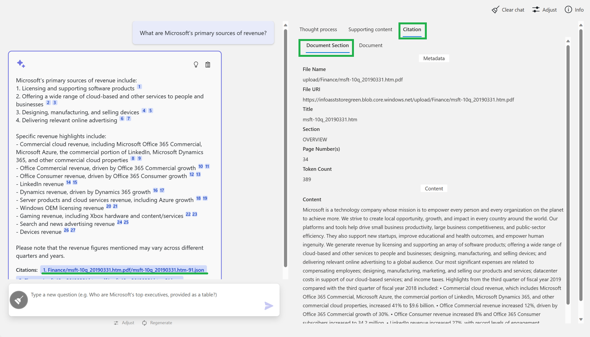

# Analysis Panel

The Analysis Panel in the UX allows the user to explore three details about the answer to their question:

* Thought Process
* Supporting Content
* Citations

In this documentation we will cover the specifics of that detail tab.

## Thought Process

The ***Thought Process*** sub-tab of the ***Analysis*** panel displays the entire thought process used throughout the Retrieval Augmented Generation (RAG) process. In the screenshot below, you can see

* Generative AI assisted query terms derived from the users question in orange
* System Prompt, derived from configured options in the ***Adjust*** panel,in yellow
* Few shot prompting questions and answer examples in blue


## Supporting Content

The ***Supporting Content*** sub-tab of the ***Analysis*** panel displays the total number of document chunks returned from the Azure AI Search index. The number of chunks returned are driven by settings in the ***Adjust*** panel.


## Citations

The ***Citations*** sub-tab of the ***Analysis*** panel includes to sub views itself. One to display a view of the indexed content for the cited section of the document ("chunk"). The second uses metadata from the document section ("chunk") to display the source file and page where the cited chunk originated from.

An example of a "chunk" would be in JSON format like:

```json
{
  "file_name": "upload/Finance/msft-10k_20200630.htm.pdf",
  "file_uri": "https://infoasststorebwcqj.blob.core.windows.net/upload/Finance/msft-10k_20200630.htm.pdf",
  "processed_datetime": "2023-05-29T21:17:23.367887",
  "title": "PART II Item 7",
  "section": "Productivity and Business Processes",
  "pages": [
    43,
    44
  ],
  "token_count": 185,
  "content": "\nRevenue increased $5.2 billion or 13%.\n\u2022 Office Commercial products and cloud services revenue increased $3.1 billion or 12%, driven by Office 365 Commercial, offset in part by lower revenue from products licensed on-premises, reflecting a continued shift to cloud offerings. Office 365 Commercial revenue grew 24%, due to seat growth and higher revenue per user.\n\u2022 Office Consumer products and cloud services revenue increased $458 million or 11%, driven by Microsoft 365 Consumer subscription revenue and transactional strength in Japan. Office 365 Consumer subscribers increased 23% to 42.7 million with increased demand from remote work and learn scenarios.\n\u2022 LinkedIn revenue increased $1.3 billion or 20%, driven by growth across all businesses.\n\u2022 Dynamics products and cloud services revenue increased 14%, driven by Dynamics 365 growth of 42%.\n3/22/23, 2:20 AM"
}
```

From this content we can derive the file name and pages the "chunk" was derived from using the **file_name** and **pages** attributes.

The "chunk" metadata displays in the ***Document Section*** sub view of the ***Citation*** sub-tab of the ***Analysis*** panel.



The full file displays in the ***Document*** sub view of the ***Citation*** sub-tab of the ***Analysis*** panel.


