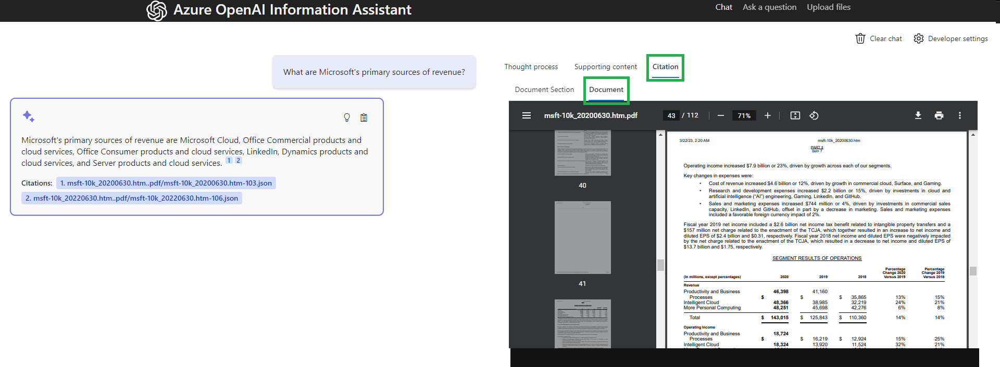

# Analysis Panel

he Analysis Panel in the UX allows the user to explore three details about the answer to their question:

* Thought Process
* Supporting Content
* Citations

In this documentation we will cover the specifics of that detail tab.

## Thought Process

TBD

## Supporting Content

TBD

## Citations

The Citations detail tab includes to sub views. One to display the section of the document ("chunk") that was indexed and returned as a selected result of the search. The second uses metadata from the document section ("chunk") to display the source file and page where the chunk was derived from.

An example of a "chunk" would be in JSON format like:

```json
{
  "file_name": "upload/Finance/msft-10k_20200630.htm.pdf",
  "file_uri": "https://infoasststorebwcqj.blob.core.windows.net/upload/Finance/msft-10k_20200630.htm.pdf",
  "processed_datetime": "2023-05-29T21:17:23.367887",
  "title": "PART II Item 7",
  "section": "Productivity and Business Processes",
  "pages": [
    43,
    44
  ],
  "token_count": 185,
  "content": "\nRevenue increased $5.2 billion or 13%.\n\u2022 Office Commercial products and cloud services revenue increased $3.1 billion or 12%, driven by Office 365 Commercial, offset in part by lower revenue from products licensed on-premises, reflecting a continued shift to cloud offerings. Office 365 Commercial revenue grew 24%, due to seat growth and higher revenue per user.\n\u2022 Office Consumer products and cloud services revenue increased $458 million or 11%, driven by Microsoft 365 Consumer subscription revenue and transactional strength in Japan. Office 365 Consumer subscribers increased 23% to 42.7 million with increased demand from remote work and learn scenarios.\n\u2022 LinkedIn revenue increased $1.3 billion or 20%, driven by growth across all businesses.\n\u2022 Dynamics products and cloud services revenue increased 14%, driven by Dynamics 365 growth of 42%.\n3/22/23, 2:20 AM"
}
```

From this content we can derive the file name and pages the "chunk" was derived from using the **file_name** and **pages** attributes.

The "chunk" displays in the **Document Section** tab of the **Citation** tab of the **Analysis Panel**.


The full file displays in the **Document** tab of the **Citation** tab of the **Analysis Panel**.


