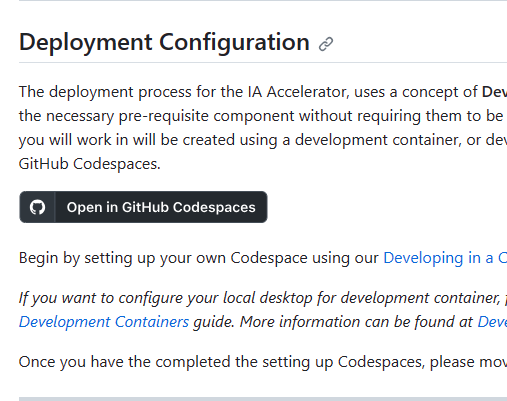
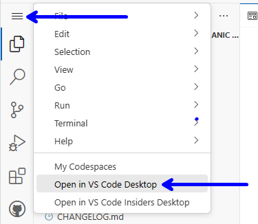
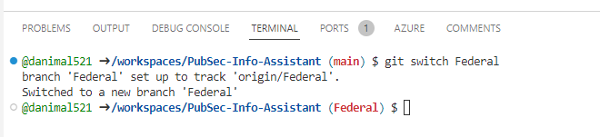
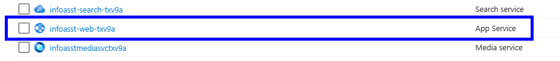
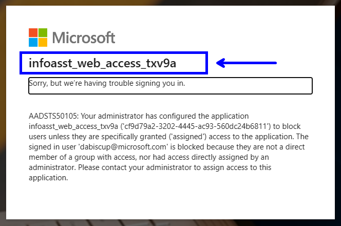
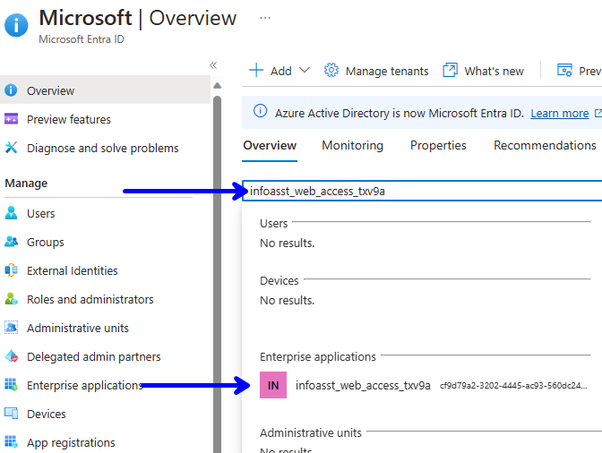
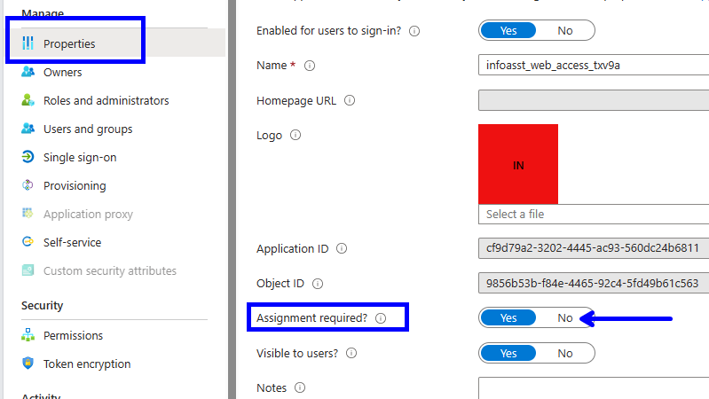
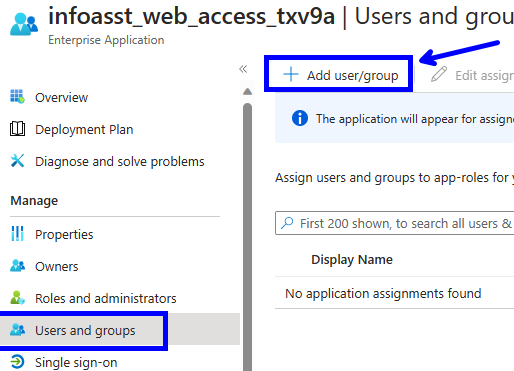
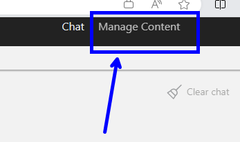
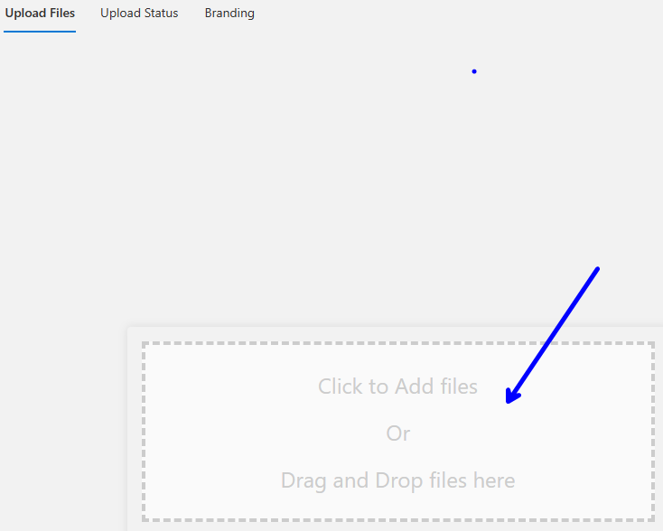

# Federal Install #

These Instructions will install the Federal Version of the Information Assistant to your Azure environment. There are three parts to this.

1)	Deploy the application
2)	Allow users/access
3)	Add files for it to chat against


# Part 1 
Deploying the application

## Step 1
Navigate to https://github.com/microsoft/PubSec-Info-Assistant

## Step 2
Click on "Open in GitHub Codespaces"



## Step 3
To get all functionality it is recommended to open this in a local VSCode instance. Click the hamburger control and select “Open in VS Code Desktop”



## Step 4
Open the terminal and enter the following commands:

``` bash
    git switch Federal
    az login
    az account set --subscription [your sub ID]
```



## Step 5
Edit your env variables.

**Navigate to:** \PubSec-Info-Assistant\scripts\environments

1) Copy **local.env.example** and save it as **local.env**

2) Replace variables with your resource group, region, subscription id and tenant and save

**Notes:**
1)	Things work better if you let it provision a new OpenAI instance, export USE_EXISTING_AOAI=false
2)	You might received errors dealing with capacity. This can be lowered here: infra/main.bicep. decrease chatGptDeploymentCapacity to ~ 200


## Step 6
Deploy to your environment. Run the below command in the terminal. After a few minutes of validation, it will ask you: **Are you happy with the plan, would you like to apply? (y/N)** 

select 'y'

``` bash
    make deploy
```


You might receive **“InsufficientQuota - The specified capacity '720'”** If so you can lower your capacity in this file: **infra/main.bicep**. decrease chatGptDeploymentCapacity to ~ 200

Then run it again.
``` bash
param chatGptDeploymentCapacity int = 200
// metadata in our chunking strategy adds about 180-200 tokens to the size of the chunks, 
// our default target size is 750 tokens so the chunk files that get indexed will be around 950 tokens each
```

# Part 2 
Setting the authentication/authorization

## Step 1
Navigate to the newly created resource group in you subscription and locate the infoassist web app **App Service**.




## Step 2
Locate the web app url and navigate to the app.


You should receive an error like below. This is because we need to setup authentication and authorization. Take note of the app registration name.




## Step 3
In the Azure portal, open Microsoft Intra ID. Seach for the above app registration and click on the result under Enterprise Applications.



## Step 4
At this point you have two options. You can allow no assignments (basically anonymous but in our tenant), or add users. 

**Note:** that after you select your authentication and authorization it takes a few minutes for everything to resolve. After this step your app will render.


**To allow anyone in the MSFT tenant, use no assignments.**




**OR to select users**




# Part 3 
At this point your application should be running. Now you have to upload a few documents to chat against.

## Step 1
Click **Manage Content** in the upper right corner.




## Step 2
Select **Upload Files** and drag and drop you content in the center window. You can select **Upload Status** to check the status of your documents. When they are completed you should be able to ask questions at your content. 

