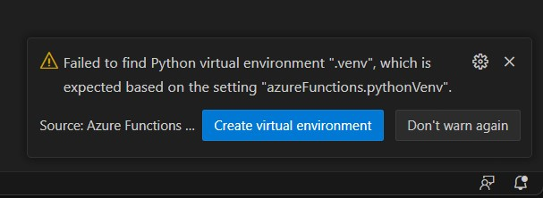
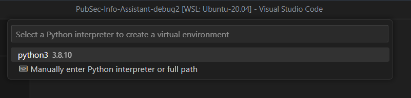
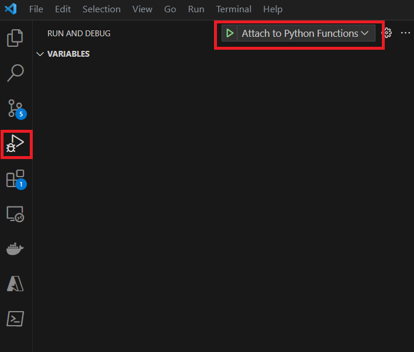
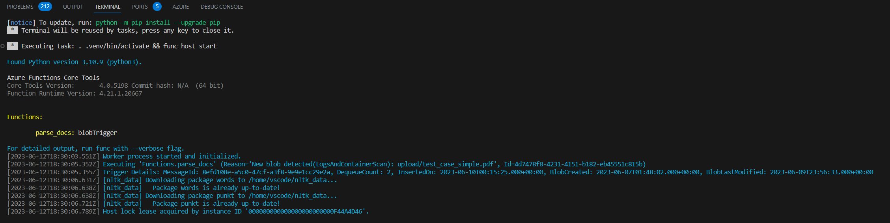

# Debugging the Azure Functions Locally in VSCode
IF you wish to debug any of the functions that are part of this accelerator, you can do this locally in VSCode and step through the logic. To do this you will need create a virtual environment. When you open your dev container, you will see a prompt notification in the bottom right of the VS Code window that will do this automatically for you. Click the 'Create virtual environment' button.



You will then be prompted to select a python interpreter. Select the latest version.



This will create a folder under the Functions folder called .venv, which is git ignored.

## Setting local configurations
Next you will need to create local configuration values that are used by the function, which include items such as the details on the storage containers used and the instance of Form Recognizer. You can create this manually, but we have provided a utility to generate this file for you, If you run a command 'make extract-env-debug-functions' this will generate a json file that includes these values called local.settings.json in the Functions folder. An example is shown below…

```json
{
  "IsEncrypted": false,
  "Values": {
    "BLOB_STORAGE_ACCOUNT_UPLOAD_CONTAINER_NAME": "<YOUR AZURE VALUE>",
    "BLOB_STORAGE_ACCOUNT_LOG_CONTAINER_NAME": "logs",
    "COSMOSDB_CONTAINER_NAME": "statuscontainer",
    "COSMOSDB_DATABASE_NAME": "statusdb",
    "COSMOSDB_KEY": "<YOUR AZURE VALUE>",
    "COSMOSDB_URL": "<YOUR AZURE VALUE>",
    "AZURE_FORM_RECOGNIZER_ENDPOINT": "<YOUR AZURE VALUE>",
    "AZURE_FORM_RECOGNIZER_KEY": "<YOUR AZURE VALUE>",
    "BLOB_STORAGE_ACCOUNT": "<YOUR AZURE VALUE>",
    "BLOB_STORAGE_ACCOUNT_OUTPUT_CONTAINER_NAME": "content",
    "BLOB_STORAGE_ACCOUNT_KEY": "<YOUR AZURE VALUE>",
    "AzureWebJobsStorage": "<YOUR AZURE VALUE>",
    "CHUNK_TARGET_SIZE": "750",
    "FR_API_VERSION": "2023-02-28 (Preview)",
    "infoasststore_STORAGE": "<YOUR AZURE VALUE>",
    "TARGET_PAGES": "ALL",
    "XY_ROUNDING_FACTOR": "1",
    "FUNCTIONS_WORKER_RUNTIME": "python",
    "AzureWebJobs.parse_html_w_form_rec.Disabled": "true"
  }
}
```
## Stepping through the code
Now you are ready to debug the functions locally. Select the Run & Debug option from left menu bar and the click the play button after ensuring you have selected 'Attach to Python Functions' from the dropdown menu. 



When the function is ready, you will see a list of active functions in yellow in the terminal windows as shown in the example below



Your functions will now run locally and you can set breakpoints in the code. After uploading a file to the upload folder you will see the functions start to process. To stop debugging, select the option from the Run menu on the main menu bar.