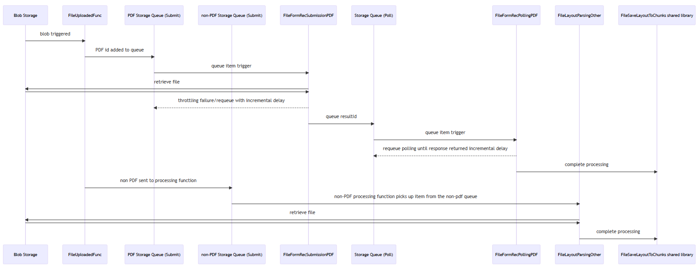

# Functions Flow
This document outlines the flow of data through the various functions and queues to pre-process the files. Below is an outline of this flow.

## Diagram

Initially files are uploaded manually, or via the UI, to the upload container in your Azure Storage Account. The action of completing the upload triggers the first function in the chain, **FileUploadedFunc**. This function is responsible for reading the file in and determining the type of file, PDF, DocX, HTML etc. It will then post a message to the **non-pdf-submit-queue** or **pdf-submit-queue** depending on the file type. This will then allow these files to be processed differently depending on their type.

We have 2 paths because we extract the content and build a map of the files content, titles, headers, paragraphs and tables etc. differently depending on the file type. For PDF's we use a service, known as [Azure Form Recognizer](https://learn.microsoft.com/en-us/azure/applied-ai-services/form-recognizer/?view=form-recog-3.0.0). Azure Form Recognizer 'cracks' a PDF file and process each page using the Layout API. It provides a JSON representation of the file including titles, sub-headings, headers, footers, tables and content paragraphs. We take this content and build a standardized JSON 'document map' of the content. 

Likewise with html files and Docx, we firstly use a library called [Mammoth](https://pypi.org/project/mammoth/) to convert these to html format. Now that we have these all as HTML, we use another library, [BeautifulSoup](https://pypi.org/project/beautifulsoup4/), to extract titles, sub-headings, headers, footers, tables and content paragraphs, similarly to using Azure Form Recognizer for PDF's. Again we create a 'document map' of the content, a json based representation. 

Listening to the **pdf-submit-queue** is a function called **FileFormRecSubmissionPDF**. This will pick up the PDF file and try to submit it to Azure Form Recognizer for processing. If this is successful it will receive an ID from Azure Form Recognizer which can be used to poll Azure Form Recognizer to receive the processed results once processing is completed. At the point it will submit a message indicating this information to the **pdf-polling-queue**. If it is not successful, a message is sent back to the **pdf-submit-queue**. However, this message is configured to not be visible to the function to pick up again for delay period specified in the function, which increases exponentially up to a maximum delay and maximum number of retries.

This pattern of trying to submit a PDF to the Azure Form Recognizer service, and then passing back to the queue if there is a failure is a necessity to compensate for the throttling limitations inherent with Azure Form Recognizer. By default the maximum throughput possible is [15 transactions per second](https://learn.microsoft.com/en-us/azure/applied-ai-services/form-recognizer/service-limits?view=form-recog-3.0.0). If you submit 100 documents at the same time there would be failures without this approach. 

Now that the message is in the **pdf-polling-queue**, the next function picks this message up and attempts to process it. The **FileFormRecPollingPDF** reaches out to Azure Form Recognizer with the id of the process and attempts to retrieve the results. if the service is still processing, which can take minutes for large files, the function closes down and the message returns to the queue with a delay before the function picks up the message and retries. Again, after a maximum number of retries, the document will be logged with a status or error. If the results are received, then the function will create the document map, a standard representation of the document, and this is then passed to the shared code functions to generate chunks.

We use this two function polling and queue pattern, rather than the SDK which uses polling also, because the processing of the PDF file can take multiple minutes. This prevents us than having an Azure Function running and just waiting, or failing if the time is too much.

The other main path through the flow is for non-PDF files. The **FileLayoutParsingOther** function listens to the **non-pdf-submit-queue** and starts processing new messages when they are received. this will convert DocX to html, if the file type is html or htm, and then it will build the same document map structure as was created for PDF files. Likewise, this function will call the same shared code functions to generate the chunks.

## Function Configuration

There are a number of settings that are configured during deployment, but which can also be updated through the configuration blade in the Azure Function App. Many of the settings relate to hard values, such as storage container names and endpoints for services, but we anticipate customers may wish to change certain configurations and these are described below.

Setting | Description
--- | ---
CHUNK_TARGET_SIZE | The number of tokens the function targets as the maximum per chunk text content to be generated. Additional metadata are added to the chunk JSON files as they are created that add roughly 180-200 tokens to the overall size of the chunk JSON file that gets indexed by Azure Cognitive Search. So we recommend setting the **CHUNK_TARGET_SIZE** to your overall size target minus 200 tokens. 
MAX_SECONDS_HIDE_ON_UPLOAD | The maximum number of seconds a message will be hidden when initially submitting to the process. The actual time a message is invisible is a random value from 0 to this cap. This spreads out initial processing so as not to hit a throttling event unnecessarily
MAX_SUBMIT_REQUEUE_COUNT | The maximum number of times the process will try to process a PDF through Form Recognizer
PDF_SUBMIT_QUEUE_BACKOFF | The number of seconds a message will remain invisible after resubmitting to the queue due to throttling during submitting to Form Recognizer
POLL_QUEUE_SUBMIT_BACKOFF | How many seconds we will initially wait before trying to retrieve processed results form Form Recognizer
POLLING_BACKOFF | If, on polling the Form Recognizer service, we learn the request is still being processed, the flow will pass a new message back to the polling queue which will become visible after this number of seconds. The delay in visibility will increase from this initial value exponentially
MAX_READ_ATTEMPTS | The maximum number of times we will try to retrieve processed results from Azure Form Recognizer
MAX_POLLING_REQUEUE_COUNT | The maximum number of times the process will submit a message to the polling queue
SUBMIT_REQUEUE_HIDE_SECONDS | If a throttling event occurs on upload, the message will be resubmitted to the queue up to a maximum amount of times specified in this setting
TARGET_TRANSLATION_LANGUAGE | The target language that the process will translate chunks into
ENRICHMENT_BACKOFF | The number of seconds a message will be invisible when resubmitted to the enrichment queue after a failure due to throttling. This will increase exponentially for every subsequent time a failure occurs
MAX_ENRICHMENT_REQUEUE_COUNT | The maximum number of times a message will be pushed to the enrichment queue after a failure in the enrichment function

## References
- [Form Recognizer service quotas and limits](https://learn.microsoft.com/en-us/azure/applied-ai-services/form-recognizer/service-limits?view=form-recog-3.0.0)
- [Cognitive Services autoscale feature](https://learn.microsoft.com/en-us/azure/cognitive-services/autoscale?tabs=portal)
- [Form Recognizer 2023-02-28-preview API Reference](https://westus.dev.cognitive.microsoft.com/docs/services/form-recognizer-api-2023-02-28-preview/operations/AnalyzeDocument)
- [QueuesOptions.VisibilityTimeout Property](https://learn.microsoft.com/en-us/dotnet/api/microsoft.azure.webjobs.host.queuesoptions.visibilitytimeout?view=azure-dotnet)
