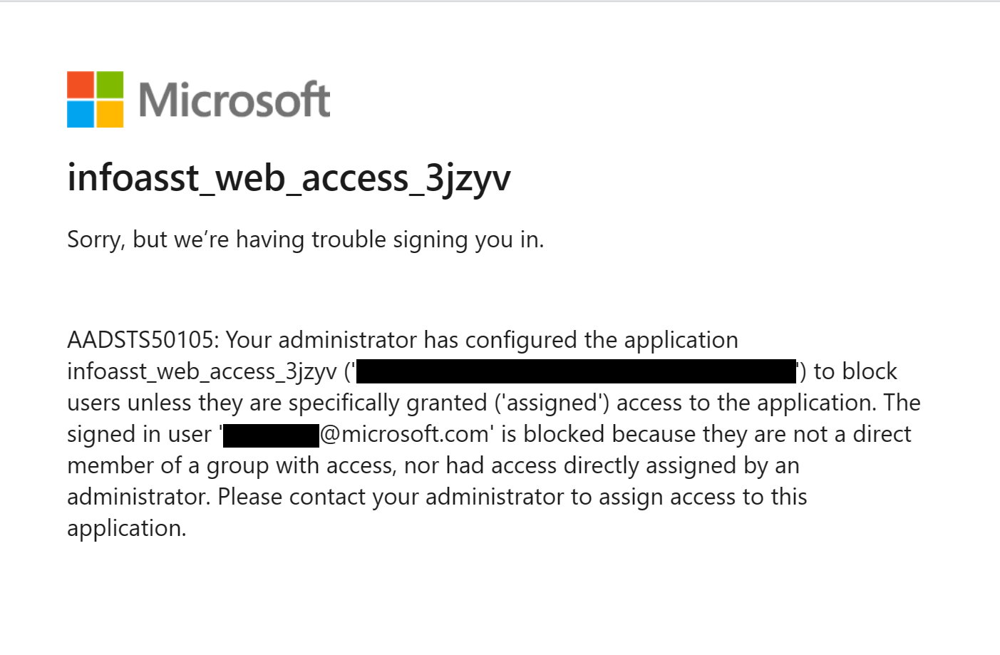

# Known Issues

Here are some commonly encountered issues when deploying the PS Info Assistant Accelerator.

## This subscription cannot create CognitiveServices until you agree to Responsible AI terms for this resource

```bash
Error: This subscription cannot create CognitiveServices until you agree to Responsible AI terms for this resource. You can agree to Responsible AI terms by creating a resource through the Azure Portal then trying again. For more detail go to https://aka.ms/csrainotice"}]

```

**Solution** : Manually create a "Cognitive services multi-service account" in your Azure Subscription and Accept "Responsible AI Notice"

1. In the Azure portal, navigate to the “Create a resource” page and search for “Cognitive Services”
2. Select “Cognitive Services” from the list of results and click “Create” 1.
3. On the “Create” page, provide the required information such as Subscription, Resource group, Region, Name, and Pricing tier 1.
4. Review and accept the terms "Responsible AI Notice"


---

## Error "Your adminstrator has configured the application infoasst_web_access_xxxxx to block users..."

By default Info Assistant deploys the webapp to require users to be a member of an Azure Active Directory Enterprise Application to access the website. If a user is not a member of the AAD EA they will receive this error:



### Solution

#### Option 1

Add the user to the Azure Active Directory Enterprise Application.

>1. Log into the Azure Portal
>2. Navigate to the App Service object in your resource group, named *infoasst-web-xxxxx*.
>3. View the **Authentication** tab. Select the "Identity Provider" link.

>4. In the **Overview** tab, Select the link under the "Essentials" section labeled "Managed application in..." that should have a value like *infoasst_web_access_xxxxx*.

>5. Select the **Users and Groups** tab and use the **Add user/group** to add the user to the Azure Active Directory Enterprise Application.

#### Option 2

Turn off the option to require membership for the Azure Active Directory Enterprise Application.

>1. Log into the Azure Portal
>2. Navigate to the App Service object in your resource group, named *infoasst-web-xxxxx*.
>3. View the **Authentication** tab. Select the "Identity Provider" link named *infoasst_web_access_xxxxx*.
>4. In the **Overview** tab, Select the link under the "Essentials" section labeled "Managed application in..." that should have a value like *infoasst_web_access_xxxxx*.
>5. Select the **Properties** tab. Change the value for **Assignment Required** to No. Click **Save**.
