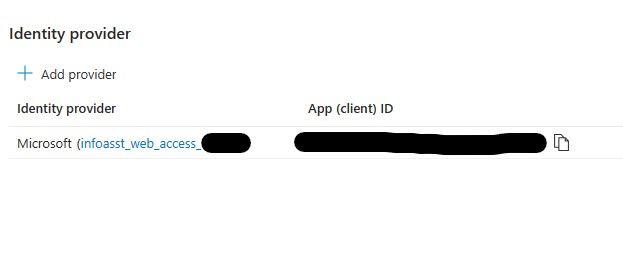

# Known Issues

Here are some commonly encountered issues when deploying the PS Info Assistant Accelerator.

## This subscription cannot create AzureIAServices until you agree to Responsible AI terms for this resource

```bash
Error: This subscription cannot create CognitiveServices until you agree to Responsible AI terms for this resource. You can agree to Responsible AI terms by creating a resource through the Azure Portal then trying again. For more detail go to https://aka.ms/csrainotice"}]

```

### Solution
Manually create a "Azure AI services" in your Azure Subscription and Accept "Responsible AI Notice"

1. In the Azure portal, navigate to the “Create a resource” page and search for “Azure AI Services”
2. Select “Azure AI services” from the list of results and click “Create”
3. On the “Create” page, provide the required information such as Subscription, Resource group, Region, Name, and Pricing tier "Standard S0".
4. Review and accept the terms "Responsible AI Notice".
5. Create the Azure AI Service.

***IMPORTANT:*** In some instances, an older subscription that has already had the "Responsible AI Notice" accepted for the old "Cognitive Services multi-service account" may require this process to be repeated for the new "Azure AI Service".

***IMPORTANT:*** In some instances, an older subscription that has already had the "Responsible AI Notice" accepted for the old "Cognitive Services multi-service account" may require this process to be repeated for the new "Azure AI Service".

---

## Error "Your administrator has configured the application infoasst_web_access_xxxxx to block users..."

By default Info Assistant deploys the webapp to require users to be a member of an Azure Active Directory Enterprise Application to access the website. If a user is not a member of the AAD EA they will receive this error:


### Solution

#### Option 1

Add the user to the Azure Active Directory Enterprise Application.

>1. Log into the Azure Portal
>2. Navigate to the App Service object in your resource group, named *infoasst-web-xxxxx*.
>3. View the **Authentication** tab. Select the "Identity Provider" link.

>4. In the **Overview** tab, Select the link under the "Essentials" section labeled "Managed application in..." that should have a value like *infoasst_web_access_xxxxx*.

>5. Select the **Users and Groups** tab and use the **Add user/group** to add the user to the Azure Active Directory Enterprise Application.

#### Option 2

Turn off the option to require membership for the Azure Active Directory Enterprise Application.

>1. Log into the Azure Portal
>2. Navigate to the App Service object in your resource group, named *infoasst-web-xxxxx*.
>3. View the **Authentication** tab. Select the "Identity Provider" link named *infoasst_web_access_xxxxx*.
>4. In the **Overview** tab, Select the link under the "Essentials" section labeled "Managed application in..." that should have a value like *infoasst_web_access_xxxxx*.
>5. Select the **Properties** tab. Change the value for **Assignment Required** to No. Click **Save**.

---

## Errors due to throttling or overloading Form Recognizer

Occasionally you will hit a 429 return code in the FileFormRecSubmissionPDF which indicates that you need to retry your submission later, or an internal error returned by AI Document Intelligence in the FileFormRecPollingPDF function, which indicates the service has hit internal capacity issues. Both of these situations will occur under heavy load, but the accelerator is designed to back off and retry at a later time, up to a maximum set of retries, which is configurable.

### Solution
The back off and retry parameter values are surfaced as configuration settings in the Azure function and can be revised through the Azure portal in the Function App Configuration or in the functions local.settings.json file which is used when debugging a function in VS Code. These values are as follows...

```
@description('The maximum number of seconds  between uploading a file and submitting it to FR')
param maxSecondsHideOnUpload string

@description('The maximum number of times a file can be resubmitted to FR due to throttling or internal FR capacity limitations')
param maxSubmitRequeueCount string

@description('the number of seconds that a message sleeps before we try to poll for FR completion')
param pollQueueSubmitBackoff string

@description('The number of seconds a message sleeps before trying to resubmit due to throttling request from FR')
param pdfSubmitQueueBackoff string

@description('max times we will retry the submission due to throttling or internal errors in FR')
param maxPollingRequeueCount string

@description('number of seconds to delay before trying to resubmit a doc to FR when it reported an internal error')
param submitRequeueHideSeconds string

@description('The number of seconds we will hide a message before trying to repoll due to FR still processing a file. This is the default value that escalates exponentially')
param pollingBackoff string

@description('The maximum number of times we will retry to read a full processed document from FR. Failures in read may be due to network issues downloading the large response')
param maxReadAttempts string
```
---
## Error : Error due to service unavailability

```
InvalidTemplateDeployment - The template deployment 'infoasst-myworkspace' is not valid according to the validation procedure. The tracking id is 'XXXXXX-XXXX-XXXX-XXXX-XXXXXXXXXX'. See inner errors for details.
InsufficientQuota - The specified capacity '1' of account deployment is bigger than available capacity '0' for UsageName 'Tokens Per Minute (thousands) - GPT-35-Turbo'.
```
### Solution

This means that you have exceeded the quota assigned to your deployment for the GPT or embeddings model.The quota is the maximum number of tokens per minute (thousands) that you can use with this model. You can check your current quota and usage in the Azure portal. To increase the quota review [learn more](https://learn.microsoft.com/en-us/azure/ai-services/openai/quotas-limits)

---

## Error:'OpenAI' is either invalid or unavailable in given region
```
InvalidTemplateDeployment - The template deployment 'infoasst-myworkspace-xxxxx' is not valid according to the validation procedure. The tracking id is 'xxxxx-xxxx-xxxxx-xxxx-xxxxxxx'. See inner errors for details.
InvalidApiSetId - The account type 'OpenAI' is either invalid or unavailable in given region.
```
### Solution:
Deploy Azure OpenAI Service only in the supported regions. Review the local.env file and update the location as per supported models and [region availability](https://learn.microsoft.com/en-us/azure/ai-services/openai/concepts/models#model-summary-table-and-region-availability)

## Error: jq parse error: Expected value before ','

If you see a jq parse error while running a deployment, it means one of the makefile scripts that extract environment variables is failing to find a value it expects. Carefully review the inf_output.json file and your local.env file used during build and deploy time

### Solution:
To resolve, carefully check your local.env file for any missing but required values. There are rare times output values are not written. In which case simply double check your configuration and rerun the ```make deploy``` command to regenerate the inf_output.json file the Makefile script parses for variables.

## Error: Creation of new Media Service accounts are not allowed as the resource has been deprecated

### Solution:
Information Assistant uses Azure AI Video Indexer (VI) which depended on Azure Media Services (AMS). AMS is scheduled for retirement on June 30 2024. As part of retirement planning, steps to transition away from the current VI account AMS dependency have been published. Please refer to this [guide](https://learn.microsoft.com/en-us/azure/media-services/latest/azure-media-services-retirement) for additional details.

VI isn't part of the Azure Media Services (AMS) retirement. Previously, Video Indexer relied on AMS for encoding, packaging, and streaming. This dependency was removed following this [guide](https://learn.microsoft.com/en-us/azure/azure-video-indexer/azure-video-indexer-ams-retirement-guide) which provides guidance on linking an Azure Storage account to the VI account.

## Error: Token limit often exceeded with PDF files

### Solution:

The root of this is table processing. If a table is greater than our target token count for a chunk, this is not respected.Essentially tables are not chunked, but treated as units. We have added a task to our board to split tables by chunk size and repeat the table header rows in each chunk..

When we switched to using unstructured.io for non-PDF documents, we were aware of the same issue there. They were planning on adding this feature. So, we need to make the change in our code, and follow up with unstructured to confirm if this has been fixed and update that path also.

This issue has been updated to an enhancement.
## Error: 

If you encounter an error similar to the one below that indicates your device must be managed.

```
ERROR: AADSTS530003: Your device is required to be managed to access this resource.
Trace ID: xxxxxxxx-xxxx-xxxx-xxxxxxxx
Correlation ID: xxxxxxxx-xxxx-xxxx-xxxxxxxx
Timestamp: 2023-10-05 19:54:05Z
Interactive authentication is needed. Please run:
az login --scope https://graph.microsoft.com//.default
make: *** [Makefile:18: infrastructure] Error 1
```

### Solution

You will need to open your Codespace in VSCode on your managed device. Please read more about opening your [CodeSpace using VSCode](/docs/deployment/developing_in_a_codespaces.md#using-github-codespaces-in-visual-studio-code).

## Error: 

If you encounter an error similar to the one below that indicates your device must be managed.

```
ERROR: AADSTS530003: Your device is required to be managed to access this resource.
Trace ID: xxxxxxxx-xxxx-xxxx-xxxxxxxx
Correlation ID: xxxxxxxx-xxxx-xxxx-xxxxxxxx
Timestamp: 2023-10-05 19:54:05Z
Interactive authentication is needed. Please run:
az login --scope https://graph.microsoft.com//.default
make: *** [Makefile:18: infrastructure] Error 1
```

### Solution

You will need to open your Codespace in VSCode on your managed device. Please read more about opening your [CodeSpace using VSCode](/docs/deployment/developing_in_a_codespaces.md#using-github-codespaces-in-visual-studio-code).

## Error: 

If you encounter an error similar to the one below that indicates your device must be managed.

```
ERROR: AADSTS530003: Your device is required to be managed to access this resource.
Trace ID: xxxxxxxx-xxxx-xxxx-xxxxxxxx
Correlation ID: xxxxxxxx-xxxx-xxxx-xxxxxxxx
Timestamp: 2023-10-05 19:54:05Z
Interactive authentication is needed. Please run:
az login --scope https://graph.microsoft.com//.default
make: *** [Makefile:18: infrastructure] Error 1
```

### Solution

You will need to open your GitHub Codespaces in VSCode on your managed device. Please read more about opening your [GitHub Codespaces using VSCode](/docs/deployment/developing_in_a_codespaces.md#using-github-codespaces-in-visual-studio-code).

## Error: This region has quota of 0 \<skuType\> cores for your subscription

You receive the following error message during `make deploy`
```bash
{"ErrorEntity":{"ExtendedCode":"52039","MessageTemplate":"{0}. Try selecting different region or SKU.","Parameters":["This region has quota of 0 PremiumV3 cores for your subscription"],"Code":"Unauthorized","Message":"This region has quota of 0 PremiumV3 cores for your subscription. Try selecting different region or SKU."}}],"Innererror":null}
```

### Solution
#### Option 1 : Request a quota increase in your subscription and region
To submit a quota increase do the following:
>1. Log into the Azure Portal
>2. Navigate to your target subscription
>3. Select the **Usage + Quotas** tab on the left
>4. On the **Usage + Quotas** blade, change the filter for ***Provider: Compute*** to ***Provider: App Services**
>5. Find the SKU and region you desire and use the **Edit** or **Submit Service Request** button to request a change. 

#### Option 2 : Use Terraform parameters to select a new SKU size
We have made variable available in the terraform scripts to allow you to override the SKU size and tier for the following:
- Backend App Service Plan: This plan hosts the Information Assistant web site
- Enrichment App Service Plan: This plan hosts the services that provide Azure OpenAI embeddings support
- Functions App Service Plan: This plan hosts the functions that process files on upload to extract, chunk, and index the files.

You can add the following parameters to your local.env file to override the default values. 

```bash
export TF_VAR_functionsAppSkuSize="S2"
export TF_VAR_functionsAppSkuTier="Standard"
export TF_VAR_appServiceSkuSize="S1"
export TF_VAR_appServiceSkuTier="Standard"
export TF_VAR_enrichmentAppServiceSkuSize="P1v3"
export TF_VAR_enrichmentAppServiceSkuTier="PremiumV3"
```