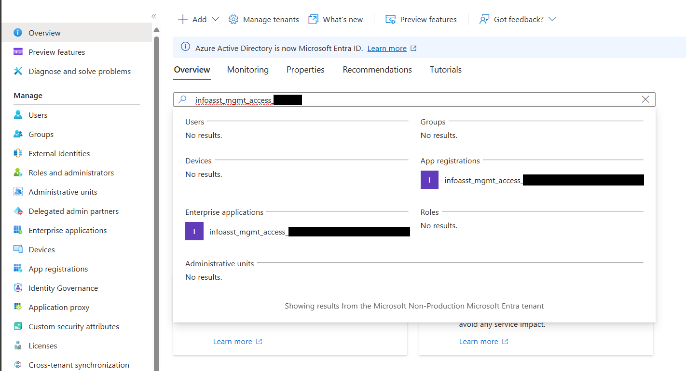
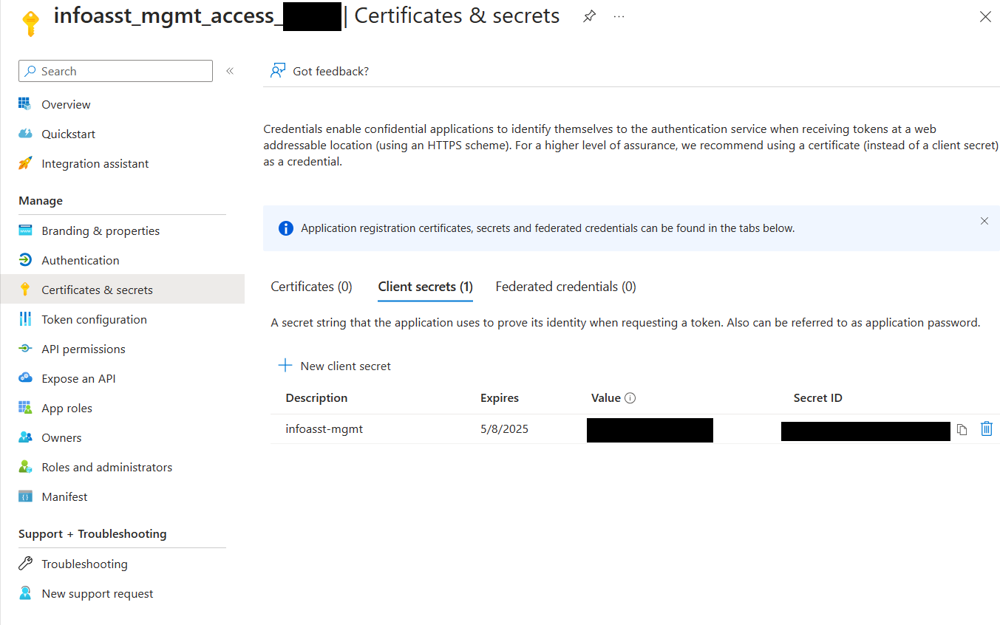

# Known Issues

Here are some commonly encountered issues when deploying the WWPS Information Assistant accelerator.

## This subscription cannot create AzureAIServices until you agree to Responsible AI terms for this resource

```bash
Error: This subscription cannot create CognitiveServices until you agree to Responsible AI terms for this resource. You can agree to Responsible AI terms by creating a resource through the Azure Portal then trying again. For more detail go to https://aka.ms/csrainotice"}]

```

### Solution

Manually create a "Azure AI services" in your Azure Subscription and Accept "Responsible AI Notice"

1. In the Azure portal, navigate to the “Create a resource” page and search for “Azure AI Services”
2. Select “Azure AI services” from the list of results and click “Create”
3. On the “Create” page, provide the required information such as Subscription, Resource group, Region, Name, and Pricing tier "Standard S0".
4. Review and accept the terms "Responsible AI Notice".
5. Create the Azure AI Service.

***IMPORTANT:*** In some instances, an older subscription that has already had the "Responsible AI Notice" accepted for the old "Cognitive Services multi-service account" may require this process to be repeated for the new "Azure AI Service".


---

## Error "Your administrator has configured the application infoasst_web_access_xxxxx to block users..."

By default Information Assistant deploys the webapp to require users to be a member of an Azure Active Directory Enterprise Application to access the website. If a user is not a member of the AAD EA they will receive this error:


### Solution

#### Option 1

Add the user to the Azure Active Directory Enterprise Application.

>1. Log into the Azure Portal
>2. Navigate to the App Service object in your resource group, named *infoasst-web-xxxxx*.
>3. View the **Authentication** tab. Select the "Identity Provider" link.

>4. In the **Overview** tab, Select the link under the "Essentials" section labeled "Managed application in..." that should have a value like *infoasst_web_access_xxxxx*.

>5. Select the **Users and Groups** tab and use the **Add user/group** to add the user to the Azure Active Directory Enterprise Application.

#### Option 2

Turn off the option to require membership for the Azure Active Directory Enterprise Application.

>1. Log into the Azure Portal
>2. Navigate to the App Service object in your resource group, named *infoasst-web-xxxxx*.
>3. View the **Authentication** tab. Select the "Identity Provider" link named *infoasst_web_access_xxxxx*.
>4. In the **Overview** tab, Select the link under the "Essentials" section labeled "Managed application in..." that should have a value like *infoasst_web_access_xxxxx*.
>5. Select the **Properties** tab. Change the value for **Assignment Required** to No. Click **Save**.

---

## Errors due to throttling or overloading Form Recognizer

Occasionally you will see a 429 return code in the FileFormRecSubmissionPDF which indicates that you need to retry your submission later or an internal error was returned by AI Document Intelligence in the FileFormRecPollingPDF function. This indicates the service has encountered internal capacity issues. Both of these situations will occur under heavy load, but the accelerator is designed to back off and retry at a later time, up to a maximum set of retries, which is configurable.

### Solution

The back off and retry parameter values are surfaced as configuration settings in the Azure function and can be revised through the Azure portal in the Function App Configuration or in the functions local.settings.json file which is used when debugging a function in VS Code. The names and values are as follows...

```text
| Name                        | Value | Description                                                                                                               |
|-----------------------------|-------|---------------------------------------------------------------------------------------------------------------------------|
| MAX_POLLING_REQUEUE_COUNT   | 10    | Max times to retry submission due to throttling or internal errors in FR                                                  |
| MAX_READ_ATTEMPTS           | 5     | Number of times to retry reading a processed document from FR                                                             |
| MAX_SECONDS_HIDE_ON_UPLOAD  | 30    | Max number of seconds between uploading a file and submitting it to FR                                                    |
| MAX_SUBMIT_REQUEUE_COUNT    | 10    | Max number of times a file can be resubmitted to FR for throttling or capacity limitations                                |
| PDF_SUBMIT_QUEUE_BACKOFF    | 60    | Number of seconds a message sleeps before resubmitting due to throttlng request from FR                                   |
| POLL_QUEUE_SUBMIT_BACKOFF   | 60    | Number of seconds a message sleeps before we poll for FR completion                                                       |
| POLLING_BACKOFF             | 30    | Number of seconds we hide a message before repolling due to FR still processing a file. This value esalates exponentially |
| SUBMIT_REQUEUE_HIDE_SECONDS | 1200  | Number of seconds to delay before trying to resubmit a doc to FR when it reported an internal error                       |

```

These variables can also be updated prior to deployment by changing the following Terraform variables
```text
maxPollingRequeueCount
maxReadAttempts
maxSecondsHideOnUpload
maxSubmitRequeueCount
pdfSubmitQueueBackoff
pollQueueSubmitBackoff
pollingBackoff
submitRequeueHideSeconds
```

---

## Error : Error due to service unavailability

```bash
InvalidTemplateDeployment - The template deployment 'infoasst-myworkspace' is not valid according to the validation procedure. The tracking id is 'XXXXXX-XXXX-XXXX-XXXX-XXXXXXXXXX'. See inner errors for details.
InsufficientQuota: This opeeration requre xxx new capacity in quota  'Tokens Per Minute (thousands) - GPT-XXX or Text-Embeddings-Ada-002 which is bigger than the current available capacity of xxx.
```

### Solution

This means that you have exceeded the quota assigned to your deployment for the GPT or embeddings model. The quota is the maximum number of tokens per minute (thousands) that you can use with this model. You can check your current quota and usage in the Azure portal. To increase the quota review [learn more](https://learn.microsoft.com/en-us/azure/ai-services/openai/quotas-limits)

---

## Error:'OpenAI' is either invalid or unavailable in given region

```bash
InvalidTemplateDeployment - The template deployment 'infoasst-myworkspace-xxxxx' is not valid according to the validation procedure. The tracking id is 'xxxxx-xxxx-xxxxx-xxxx-xxxxxxx'. See inner errors for details.
InvalidApiSetId - The account type 'OpenAI' is either invalid or unavailable in given region.
```

### Solution

Deploy Azure OpenAI Service only in the supported regions. Review the local.env file and update the location as per supported models and [region availability](https://learn.microsoft.com/en-us/azure/ai-services/openai/concepts/models#model-summary-table-and-region-availability)

---

## Error: jq parse error: Expected value before ','

If you see a jq parse error while running a deployment, it means one of the makefile scripts that extract environment variables is failing to find a value it expects. Carefully review the inf_output.json file and your local.env file used during build and deploy time

### Solution

To resolve, carefully check your local.env file for any missing but required values. There are rare times output values are not written. In which case simply double check your configuration and rerun the ```make deploy``` command to regenerate the inf_output.json file the Makefile scripts parse for variables.

---

## Error: Token limit often exceeded with PDF files

### Solution

This was a problem with early deployments of Information Assistant 1.0. The root cause of this error is table processing. If a table is greater than our target token count for a chunk, this is not respected meaning tables are not chunked, but treated as units. We now split tables by chunk size and repeat the table header rows in each chunk.

This issue was resolved in a hotfix to the main branch of Information Assistant 1.0, so please upgrade to version 1.0 or later.

---

## Error

If you encounter an error similar to the one below that indicates your device must be managed.

```bash
ERROR: AADSTS530003: Your device is required to be managed to access this resource.
Trace ID: xxxxxxxx-xxxx-xxxx-xxxxxxxx
Correlation ID: xxxxxxxx-xxxx-xxxx-xxxxxxxx
Timestamp: 2023-10-05 19:54:05Z
Interactive authentication is needed. Please run:
az login --scope https://graph.microsoft.com//.default
make: *** [Makefile:18: infrastructure] Error 1
```

### Solution

You will need to open your Codespace in VSCode on your managed device. Please read more about opening your [CodeSpace using VSCode](/docs/deployment/developing_in_a_codespaces.md#using-github-codespaces-in-visual-studio-code).

---

## Error: This region has quota of 0 \<skuType\> cores for your subscription

You receive the following error message during `make deploy`

```bash
{"ErrorEntity":{"ExtendedCode":"52039","MessageTemplate":"{0}. Try selecting different region or SKU.","Parameters":["This region has quota of 0 PremiumV3 cores for your subscription"],"Code":"Unauthorized","Message":"This region has quota of 0 PremiumV3 cores for your subscription. Try selecting different region or SKU."}}],"Innererror":null}
```

### Solution

#### Option 1 : Request a quota increase in your subscription and region

To submit a quota increase do the following:
>
>1. Log into the Azure Portal
>2. Navigate to your target subscription
>3. Select the **Usage + Quotas** tab on the left
>4. On the **Usage + Quotas** blade, change the filter for ***Provider: Compute*** to ***Provider: App Services**
>5. Find the SKU and region you desire and use the **Edit** or **Submit Service Request** button to request a change.

#### Option 2 : Use Terraform parameters to select a new SKU size

We have made variable available in the terraform scripts to allow you to override the SKU size and tier for the following:

- Backend App Service Plan: This plan hosts the Information Assistant web site
- Enrichment App Service Plan: This plan hosts the services that provide Azure OpenAI embeddings support
- Functions App Service Plan: This plan hosts the functions that process files on upload to extract, chunk, and index the files.

You can add the following parameters to your local.env file to override the default values.

```bash
export TF_VAR_functionsAppSkuSize="S2"
export TF_VAR_functionsAppSkuTier="Standard"
export TF_VAR_appServiceSkuSize="S1"
export TF_VAR_appServiceSkuTier="Standard"
export TF_VAR_enrichmentAppServiceSkuSize="P1v3"
export TF_VAR_enrichmentAppServiceSkuTier="PremiumV3"
```
## My image search is not working and returning "I'm sorry, but I don't have any information about..."

### Solution
Image search is currently only supported with regions that support dense captions. You will need to deploy Information Assistant to one of the regions that supports dense captioning. A full list of regions that support dense captioning can be found [here](https://learn.microsoft.com/en-us/azure/ai-services/computer-vision/concept-describe-images-40?tabs=dense)

## There are errors in the SharePoint Logic App Designer

### Solution
These are only in the Logic App Preview Designer. Switching to the Generally Available Designer will resolve these errors. They are purely visual errors in the Preview Designer and have no impact on how the Logic App functions.


---

## Error: CredentialInvalidLifetimeAsPerAppPolicy: Credential lifetime exceeds the max value allowed as per assigned
### Solution
Your organization's policy places a limit on the lifetime of an identities password. In your copy of Local.env there is a setting called PASSWORD_LIFETIME. This value is used when creating or updating the identity password and has a default value of the number of days the password will exist before expiring. Change this value to a number of days that your organization allows.

To view the value after deploying go the Microsoft Entra ID page from the Azure Portal home page. Then search your tenant for infoasst_mgmt_access_<your-5-character-suffix> as shown in the image below.



Next click on the App Registration value, and then the page will open for that applciuation registration. Then select Clients & Secrets from the left menu. You will then see the expiry date of the password that was applied through Terraform.

