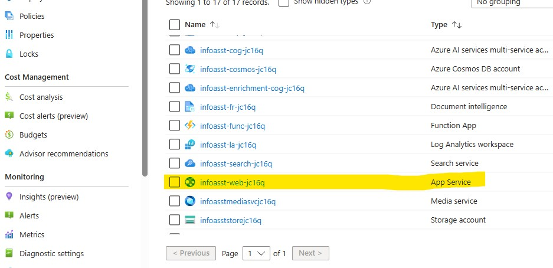
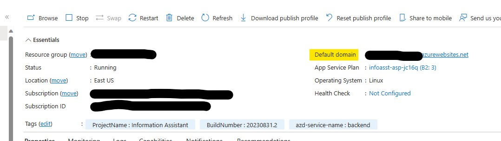

# Configure Azure resources

## Deploying the accelerator

Now that your Codespace/Dev Container and ENV files are configured, it is time to deploy the Azure resources. This is done using a `Makefile`.

To deploy everything run the following command from the Codespace/Dev Container prompt:

```bash
    make deploy
```

This will deploy the infrastructure and the application code.

*This command can be run as many times as needed in the event you encounter any errors. A set of known issues and their workarounds that we have found can be found in [Known Issues](../docs/knownissues.md)*

### Additional Information

For a full set of Makefile rules, run `make help`.

``` bash
vscode ➜ /workspaces/<accelerator> (main ✗) $ make help
help                            Show this help
deploy                          Deploy infrastructure and application code
build                           Build application code
infrastructure                  Deploy infrastructure
deploy-webapp                   Deploys the web app to Azure App Service
deploy-search-indexes           Deploy search indexes
extract-env                     Extract infrastructure.env file from BICEP output
```

## Configure authentication and authorization

If you have chosen to enable authentication and authorization for your deployment by setting the environment variable `REQUIRE_WEBSITE_SECURITY_MEMBERSHIP` to `true`, you will need to configure it at this point. Please see [Known Issues](../docs/knownissues.md#error-your-adminstrator-has-configured-the-application-infoasst_web_access_xxxxx-to-block-users) section for guidance on how to configure. 

**NOTICE:** If you haven't enabled this, but your Tenant requires this, you may still need to configure as noted above.

## Find your deploment URL

Once deployed, you can find the URL of your installation by:

1) Browse to your new Resource Group at https://portal.azure.com and locate the "App Service"


2) After clicking on the App Service, you will see the "Default domain" listed. This is the link to your installation.



## Next steps

At this point deployment is complete. Please go to the [Using the IA Accelerator for the first time](../README.md#using-ia-accelerator-for-the-first-time) section and complete the following steps.

